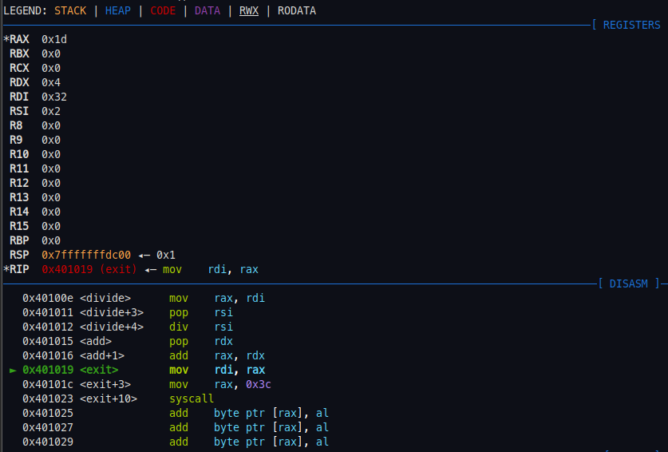

This week Ben led a session on some basic assembly shellcoding. The first section of the session covered some foundational theory content on CPU architecture, registers, and memory. After this, assembly was introduced - we used x86_64 assembly with Intel syntax. In this article we will go through one method of solving each assembly challenge. The shellcode solutions will be released at a later date. 

You can download the presentation [here](presentation.pptx).

## Task 1

The first challenge asked us to write a script to calculate `(x * y) / z + a`, so how would we go about this? First assign values

```
x = 10
y = 5
z = 2
a = 4
```

Let's start by push x,y,z,a to the stack. Since the stack is LIFO we should push in reverse order, so that we can access x & y first. Whilst demoing this in the session, it was pointed out that would could move the values directly into the relevant registers, however we showed it this way because it introduces the concept of interacting with memory.

```asm
.global _start
.intel_syntax noprefix

_start:
push 4
push 2
push 5
push 10
```

Next we should pop x and y into registers and multiply them.

```
times:
/* 10 * 5 */
pop rdi
pop rsi
imul rdi, rsi
```

Now we need to divide by z. Remember in assembly the operator of the integer division should be stored in rax, and we call div with the register containing the operand. 

```
divide:
mov rax, rdi
pop rsi
div rsi
```

Now we simply need to add a, and exit.

```
add:
pop rdx
add rax, rdx

exit:
mov rdi, rax 
mov rax, 60
syscall

```

We then assembled our code. 

```
$ gcc task1.s -o task1.elf -nostdlib -static
```

With this done, we could step through the program with our debugger to see the result of our code. We can see tha value in rax is 0x1d, 29 in decimal, which is the correct answer.

We can load the program into gdb, start the program with a breakpoint using `starti`, and step through the program using `n`. The context will be printed after each step, and we can call the different context sections. (ie context registers) in case the sections scroll off the page.



## Task 2

The next task was to use a loop to calculate `x ^ 3`. We will do `4 ^ 3`.

So lets get 4 into a register.

```
.global _start
.intel_syntax noprefix

/* we will do 4 ^ 3*/
_start:
xor rax, rax
mov rdi, 4
mov rsi, rdi
```

Now we want to build a loop. For the loop, we will build an if statement using a a conditional relative jump. rax is compared to decimal 2, if they are equal then a conditional relative jump is performed to the label `done:`. Otherwise the program continues to the multiply statement. The value of rax is then increased by 1, and a relative jump is made to the `loop:` label.

```
loop:
cmp rax, 2
je done
imul rdi, rsi
inc rax
jmp loop

done:
mov rax, 60
syscall
```

We can see that the resulting value, stored in rdi, is 0x40 or decimal 64. This is the correct answer. 


## Task 3

Task 3 was slightly more complicated. The instructions were as follows:

- Calculate y = x/z
- If y is odd then exit
- If y is even, divide again, loop until odd

We will use starting values `x = 11906` `y = 4`. Let's get the those values into registers then.

```asm
.global _start
.intel_syntax noprefix

_start:
push 4
push 11906
pop rax
pop rsi
div rsi 
```

How do you know if a number is even or odd ? Well in binary, if a number is odd the the least significant bit (LSB) **must** be 1 (ie 3 = 0011 as 4 bit binary), if it is even then the LSB **must not** be 1 (ie 2 = 0010 as 4 bit binary). So we can test the value of the LSB to know whether a number is odd of even.

We can use a conditional relative jump if the number is odd to the label `odd:`, which will exit the program. Otherwise divide again and relative jump back to the `test:` label

```
test:
test al, 1
jnz odd
```

Using loops in the same way as task 2, you should now be able to implement the rest of the code yourself.


## Conclusion

We hope you found this an interesting session, or at the very least that you learnt something. We will hopefully be looking at some reverse engineering next week. If you enjoyed these assembly challenges the definitely checkout the shellcode challenges on [CTFd](https://cueh-comsec.ctfd.io/).