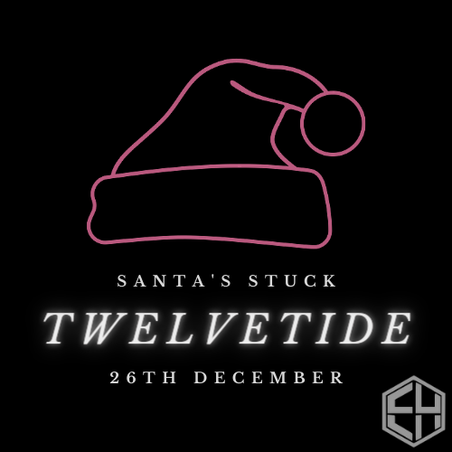

Hi everyone, 

Hope you're all enjoying yourselves now that coursework deadlines have passed. As Christmas approaches ComSec would like to announce the dates of our Christmas CTF - Twelvetide. 

The CTF will last 15 days, with new challenges released every day for the first 12 days. Difficulty will range from entry-level to intermediate, so make sure you sign on and give it a go!

More details will be released on the ComSec discord in coming days. If you are not a member, check our post on Aula, or search for ComSec in your university email contacts.

Merry Christmas 

- Ben, Jack & Tiago

(ComSec)

