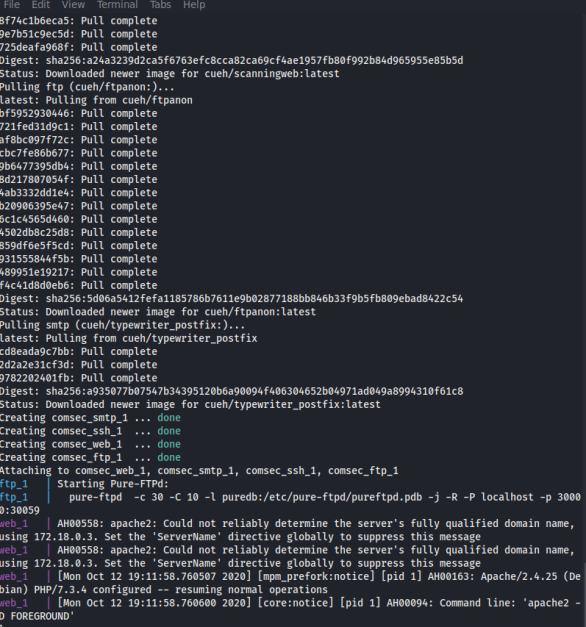
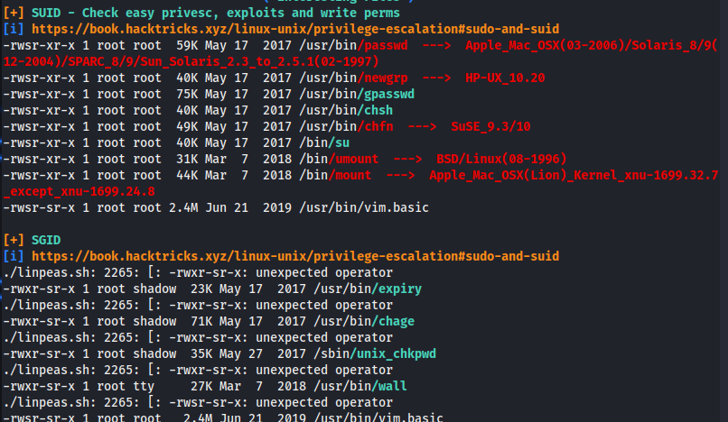

# Nmap 1

So first week of comsec I hope everyone enjoyed the slides and is prepared for the ctf.


after running this commands
```bash
git clone https://github.com/Cov-ComSec/ComSecMaterials.git
cd docker1 
docker-compose up
```
After running this commands you should see something like this in your terminal.



If you do see this it means you are ready for playing.
Minimize your shell open a new one and start scanning.

### Nmap Scan

```bash
sudo nmap -sC -sV 172.18.0.1
```


It looks like we have 4 ports open 21,25,80,8080
Lets navigate to http://172.18.0.1

If you look at your nmap scan you can see that u have something like "/ftp-uploads" so this a directory in the website let's see whats going on in there. We have a folder called a anonymous let's see what's inside. Hm a file called FTPflag.txt looks like we found the first flag. Good Job!


So you have one flag.To be honest this flag works more like a hint to tell you what you should do after this. So if you go back to your nmap scan you will see that you have a line "21/tcp open ftp Pure-ftp" so we have a file transfer protocol it is always good to check as this can sometimes be used for file upload to the machine you are attacking. But what's the mean of ftp-anonymous if you do a fast google search you will find out that when this happens you can have acces to ftp server without having to know the credentials.So lets try to connect to the ftp.

```bash
ftp 172.18.0.1
```
You will be asked to input the Name. You just have to type anonymous to connect.
If you do a "ls" you will be able do see the a file called FTPflag.txt which is the same file you found in the website. You type help you will see as the commands that you can use inside the ftp, we want to upload p0wnyshell so that we can get access to the machine through the browser. For now you just need to know that we are using p0wnyshell as our reverse-shell. So "ctrl+c" to stop the ftp connection clone p0wny shell repository [P0wny-Shell](http://github.com/flozz/p0wny-shell.git).
```bash
cd p0wny-shell
ftp 127.18.0.1
put shell.php
```
The last command is going to upload our shell.
If you go back to your browser and back to "/ftp-uploads/anonymous" you will see the file shell.php in there clicked and you will have p0wny-shell. So you succefully entered the machine. Let's look for the last flag. A easy way to find files on linux is using the file command.
```bash
find / -name "*.txt" 2>/dev/null
```


Congratulations! Lets move to docker2

# Nmap 2

So to prove how important is nmap we setup a second nmap challenge but right now we not following the common ports as you can see in here. We mangled the ports 


```bash
sudo nmap -sC -sV 192.168.42.1 -p-
```


In this challenge the ftp part is the same as the first challenge and the first flag is the same, the only difference is that the ports have been changed so if you to "http://192.168.42.1" the website is not going to load you need to instead look for something like this "192.168.42.1:8080".
So lets pass to the second part uploading files to ftp. We have ftp running on port 2121 (2121/tcp ccproxy-ftp) last time you use "ftp $ip" to connect this time that wont work cause you will need to specify the port os instead use something like this "ftp $ip port"
```bash
ftp 192.168.42.1 2121
```
Again use anonymous as login. 
In this challegne we introduced privesc so we will need a scrip to enumerate all te services that are being run on the machine, file permissions, file types, sym links ,etc.
There are 2 that are I know, LinEnum and linpeas. I prefer [linpeas](https://github.com/carlospolop/privilege-escalation-awesome-scripts-suite/blob/master/linPEAS/linpeas.sh), instead of cloning the repository what I did is I open my prefered text editor on my kali box and I just copy/pasted the script. Then I stopped the ftp connection I cd to the directory where I have linpeas, I started the connection again and use the "put linpeas.sh" to copy linpeas to the machine. Besides linpeas we will need a php reverse shell, cause p0wny shell is not going to work in this challenge. Another good resource to put in your bookmarks, [PentestMonkeys](https://github.com/pentestmonkey/php-reverse-shell) I did the same process with both linpeas and the [php-reverse-shell](https://github.com/pentestmonkey/php-reverse-shell/blob/master/php-reverse-shell.php) so open your editor and "ctrl+c / ctrl+v" put hte ip of your kali box in the line where you see "" \\change this" and upload the file to the ftp.
So right now you should see something like this 


Which means you ready. Open a terminal and start netcat.
```bash
nc -lvnp 1234
```
Go to "192.168.42.1:8080/ftp-uploads/php-reverse-shell.php" the site should be loading for ever. If you go back to your terminal you should have access to the box.
Tip: everytime I get a reverse shell I try to find out what user I am.
```bash
whoami
```
Lets not forget we are in /var/www , we need to copy our linpeas script to tmp folder.
```bash
cp linpeas.sh /tmp
chmod +x linpeas.sh
./linpeash.sh
```
Take a look at the output and try to find the SUID section. If you don't know SUID is a type of permission that you have on linux that let's the user run the file or binary. 



That last line mentioning vim.basic maybe we can do some research and see how we can exploit it. Fortunately there is a good resource called ["GTFOBINS"](https://gtfobins.github.io/) which is used for looking how we can exploit binaries look for vim and you will see that you can spawn a shell inside vim or using the command. 
```
:!/bin/sh
#or
vim -c ':!/bin/sh'
```
Now you are root!
```bash
cd /root
cat flag.txt
```
Congrats!
Any doubts contact ComSec Committee on discord.
Don't to submit your flags in [CTFD](https://cueh-comsec.ctfd.io/)


Author:Tiago Pascoal @bs1phc


