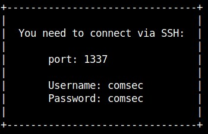
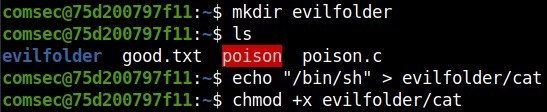
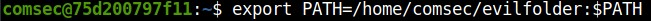
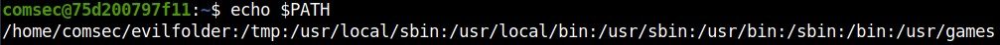

# Log and PATH Poisoning


In this session we talked about log files, the PATH variable and how an attacker could exploit them. Briefly, the PATH is a system variable unique to UNIX systems which defines the hierarchy that the CPU uses to find executable binaries. If someone were to prepend or append a valid directory to the PATH, then the CPU would consider it as a valid location to find binaries in. Similarly, log files can be used as a vector for code execution if the permissions were to be misconfigured.

Presentation slides can be found [here](files/presentation.pdf).

## Demo 1: PATH poisoning

As I said before, the PATH is an environmental variable that tells the shell where to locate executable binaries. Using 'echo' it's possible to print the PATH to screen and using 'export' it's possible to prepend or append valid directories. PATH checks the directories in order, from left to right, so if a directory is prepended to the PATH, it would be parsed and checked before any other directory; making it a perfect place to store malicious payloads.

The demo starts with a box that gives us instruction on how to connect and an username to connect as.


Using the command ```ssh -p 1337 comsec@<ip>``` and the password given, we can login as user comsec and we discover that an executable file is present


We also see two ther files, a C file that is presumably the source code for our executable and a text file. By opening the C file we gain an understanding of what it does.


We found our vulnerability! The script executes a command, as root, without specifiying the absolute path of the binary used (cat in our case).
This is easily exploitable by creating a file called 'cat' which content is '/bin/sh' so that when called, it will drop us a shell.



Also, we need to prepend the folder to the PATH so that our evil version of 'cat' is executed before the real 'cat'.





Now, the only thing left to do is execute 'poison' once again and get our root shell to drop.


## Demo 2: Log poisoning

Log poisoning, unlike PATH poisoning, can work with web applications as well as locally. The most basic example of log poisoning is apache log poisoning, where an attacker exploits either 'access.log' or 'error.log' in order to write custom payloads which allow to gain code execution. The demo uses 'access.log' to demonstrate how log poisoning works.

The first thing we see after navigating to the target web page is a portal that allows the user to select a different kind of snake and read very interesting facts about them.


As we try to read facts about a different snake, we can notice that the URL changed as well.


This is easily recognizable as an LFI vulnerability which can be used to read any file that the webapp (aka www-data) has access to. We can use it to try to read apache log files.


Yes! Now that we managed to actually read the file all there's left is to actually poison this logfile but, how do we do it? Well, given the nature of the logfile, access.log will record any connection attempt made, as well as the header of the request, even the connection (for example) to non-existant pages. Since the target runs a PHP application, we can submit a request with a simple webshell in the header, then connect to access.log and specify our command as a URL parameter.

The following script is the one used to forge and send the malicious request.
```py
import requests

URL = "http://172.17.0.2:80/evil"
ua = {"User-Agent": "<p><?php system($_GET['p']);?></p>"}
r = requests.get(URL, headers=ua)
```

Now, if we exploit the LFI vulnarbility in order to read access.log, we can see that it gives us a 'Fatal Error' since the argument 'p' is not present. This is the indicator that our script worked.


At this point, we can insert our payload in the URL and refresh the page in order to see that we got code execution!


The only thing left is to find the flag and read it. In order to do this we use 'find' and 'cat'.


## Conclusion

We hope this session interested you, even though this may be pretty simple and seemingly basic concepts, log poisoning is not rare and path poisoning is interesting if paired with cronjobs. On CTFd there are also a couple of challenges for you to try!

