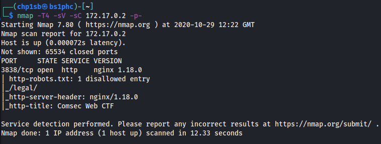

# Web Enumeration Writeup

Web Enumeration ctf
Start your docker instances and let's hack!
8 flags inside this machine

Every time first thing to do Nmap scan


Look at your scan results. So we have one port open 3838/tcp and we have at least one directory '/legal' and one file robots.txt and the box is running nginx.
First thing lets open the browser and navigate to 172.17.0.2

Get a good look at the source code and the style.css and should be able to find the flag1.
Well this week is all about list and enumerating web apps so let's do it. You have a lot of tools from gobuster, ffuf, dirbuster and etc.
I'll be using dirbuster. Dirbuster is better for recursion.


Looks like we have a lot more inside this Web App.

## Robots.txt

Lets go to robots.txt. Robots.txt is always a good spot to look for flags in ctfs and sometimes u can get information about other directories will you wait for your scans and scripts to end.
You should have one flag2.


## /legal/

How boring can we be? Actually is always good to remind you guys we are living in the grey area. Here you have the first 2 sections of the Computer Misuse act 1990. Opens your eyes cause in the middle of all of those words you should be able to find flag3 you just need to loose and 10 secs in cyberchef and one more is done. 


### /legal/papers

Hm how good are you at web dev? Do you guys know which tags you can use while inserting an image?
Do you what the alt tag does?
If you don't while do a brief explanation. So inside the alt='' tag you will have alternate text that will be shown when the image cannot be displayed. Look at the alt tag for this image and flag4 is done. 


## 404

404 is a page that can be really important for the attacker if not well setup. From the 404 page we can sometimes extract important information for example the version of the distro or server ,etc. This kinds of information can be really important sometimes to find CVES and other vulns.
By the way, always check the source code.


## .well-known/security.txt

Have you heard of this directory before? If you haven't you can read about it [here](https://en.wikipedia.org/wiki/Security.txt){target=_blank}. Always good to check.

## Flag.txt

Looks like we can't see this file maybe after getting our reverse shell we will be able to.


## wp-content

Let's go back to the dirbuster scan, you have a page called wp-content. For the people that don't know this is the standard page for uploading files in wordpress. Get your reverse shells from pentestmonkeys upload the file. It will appear as a link in the same page. Before clicking it, run your netcat in the terminal


```
nc -lvnp 1234
```
Go back to the browser and click the file and you should have the tty.

Navigate to /var/www/ and cat the flag.txt
Flag7 only one left.
Let's get root.
So without using any script lets enumerate the SUID permissions using
```
find / -perm /4000 2>/dev/null
```
Looks like we can run sudo.
Lets look for the permissions.
```
sudo -l
```

If you do id now you will be able to see you are root. 

```
cat /root/flag.txt
```
Done Congrats!

