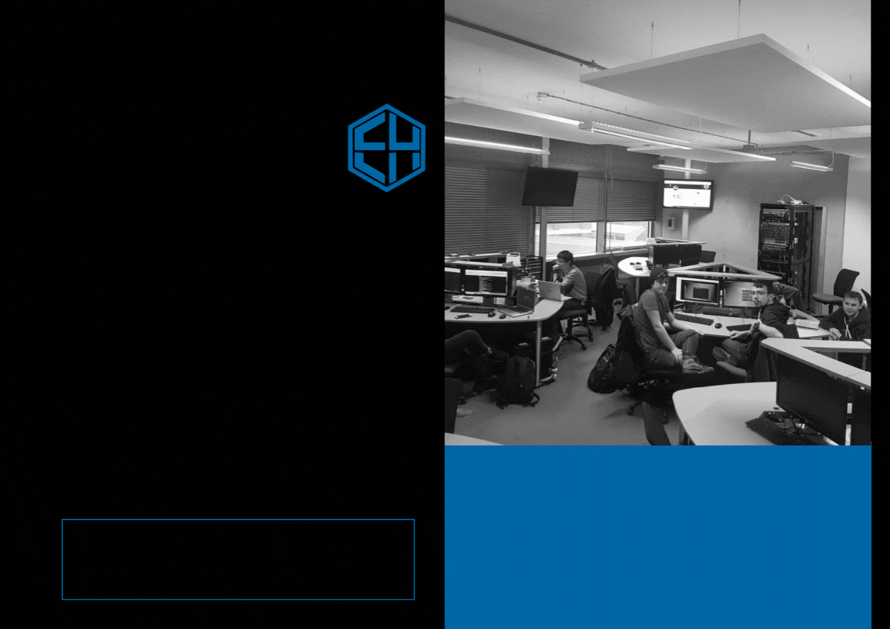

# We're Back!

Welcome to a new year at ComSec — Coventry University's unofficial ethical hacking society. We are proud to announce due to the relaxation of COVID-19 rules, we will be holding in-person events every week on Wednesday at 2pm. Also, if the interest is there; we will offer a live-streamed version available on our Discord channel (please let the committee know prior to the session). We would also, like to take this opportunity to formally welcome our latest committee member, Ben!

## What is ComSec?
As a society, our main aims are to:
- Learn & practise new cybersecurity/ethical hacking skills
- Organise and compete CTF competitions on an international stage (we do this under the team name ethical slackers and have previously taken part in RuCTFe among others)
- Create a warm and welcoming environment which is beginner and pro friendly and to share our skills from people across the University.
- Hold conversations and meet-ups with people and businesses associated with Ethical Hacking and Cybersecurity

To create a warm and welcoming environment; we follow and uphold a [code of conduct](/conduct)

## Taster Session
See what ComSec has to offer and join us in our first session on Wednesday 15th September at 2pm. If you have any questions; drop us an email by searching for ComSec in your university email contacts!

